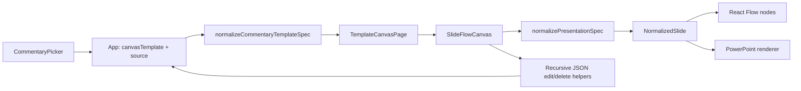
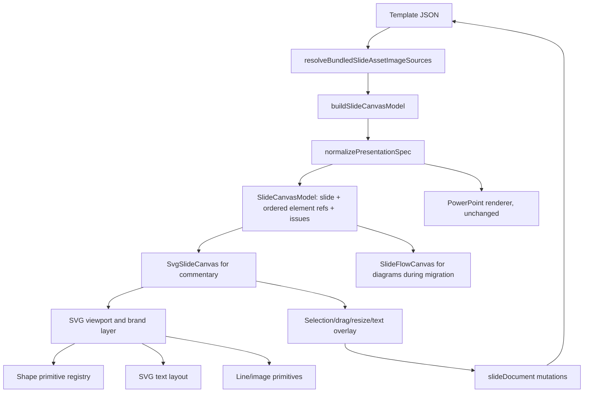

# Commentary Slide SVG Renderer Plan

## Goal

Render and edit commentary slides with a first-party SVG canvas instead of React Flow, while preserving the existing commentary JSON, PowerPoint export behavior, element ordering, and canvas editing capabilities.

The recommended migration is commentary-first: introduce a renderer-neutral slide model and a new SVG surface, route commentary templates to it, and keep React Flow temporarily for architecture diagrams. Once the SVG surface has interaction and visual parity, the same renderer can replace React Flow for diagrams as a separate decision.

## Executive recommendation

Build one root `<svg>` per slide with a fixed slide-space `viewBox` (normally `0 0 1280 720`). Render every normalized slide element as a positioned SVG `<g>`, backed by reusable primitives for shapes, text, images, and lines. Keep transient selection/editing state in the SVG canvas, but continue committing edits to the existing template JSON through `onChange`.

Use native SVG `<text>` and `<tspan>` for the display layer. Use a temporary, absolutely positioned HTML text editor only while a text element is being edited. Avoid `<foreignObject>` in the display layer because it reduces portability and makes later SVG serialization or image export less predictable.

Do not create a commentary-only data schema. The existing `NormalizedPresentation` / `NormalizedSlide` / `NormalizedElement` types are already the correct common contract between JSON normalization, the browser renderer, and PowerPoint export.

## Current project map

The repository is a Vite/React 19 application. Commentary and architecture templates currently share the same canvas page and rendering implementation.



Relevant files and responsibilities:

| Area | Current file(s) | Role in the migration |
| --- | --- | --- |
| App routing/state | `src/App.tsx` | Knows whether the selected template is commentary or diagram; should choose the canvas renderer. |
| Commentary catalog | `src/lib/commentaryTemplates.ts` | Loads the three commentary JSON files and applies commentary-specific normalization. |
| Commentary cleanup | `src/lib/commentaryBulletOrdering.ts`, `src/lib/export/PowerpointBranding.ts` | Reorders finding bullets and removes extracted branding elements. |
| Canvas page | `src/pages/TemplateCanvasPage.tsx` | Hosts the renderer, add-shape controls, JSON panel, and PowerPoint export controls. |
| React Flow surface | `src/lib/slide-flow/SlideFlowCanvas.tsx` | Currently contains rendering, selection, drag, resize, line editing, text editing, and raw JSON mutation in one 1,600-line component. |
| React Flow model | `src/lib/slide-flow/model.ts` | Converts a normalized slide into React Flow nodes. The normalization part should become renderer-neutral. |
| Shared normalized model | `src/lib/shared/PowerpointTypes.ts` | Defines the four element kinds: shape, text, line, and image. Preserve this contract. |
| JSON normalization | `src/lib/shared/PowerpointNormalizer.ts`, `PowerpointNativeNormalizer.ts`, `PowerpointExtractedNormalizer.ts` | Converts native and extracted slide JSON into the normalized model used by preview, import, and export. |
| Layering | `src/lib/shared/PowerpointLayering.ts` | Provides connector-aware element order and line occlusion rectangles. Reuse this in SVG DOM order. |
| Asset resolution | `src/lib/export/PowerpointAssetResolver.ts` | Resolves bundled image paths before browser rendering. Reuse unchanged. |
| PowerPoint output | `src/lib/export/PowerpointRenderer.ts` and related export modules | Produces native PowerPoint shapes and text. Keep independent of the browser SVG renderer. |
| Existing brand asset | `src/slide-assets/west-monroe-frame.svg`, `element-5.png` | Can supply the browser SVG brand frame and logo. |
| Styling | `src/lib/slide-flow/slide-flow.css`, `src/index.css` | Contains React Flow selectors and shared canvas color variables that need to be split or renamed. |

## Repository findings that affect the design

### React Flow is localized, but model and behavior are mixed together

`@xyflow/react` is directly used only by `src/lib/slide-flow/model.ts`, `src/lib/slide-flow/SlideFlowCanvas.tsx`, and a redundant global stylesheet import in `src/App.tsx`. `TemplateCanvasPage` is the only consumer of `SlideFlowCanvas`.

This makes the dependency replaceable, but the current component also owns renderer-independent behavior: immutable JSON edits, deletion, normalized text-run rebuilding, text fitting heuristics, coordinate rounding, and element geometry. Those pieces should be extracted before implementing the new surface.

### The commentary templates are a bounded first target

After current commentary normalization removes extracted frame assets, the three templates contain:

| Template | Elements | Text | Shapes | Shape names |
| --- | ---: | ---: | ---: | --- |
| Architecture SSA | 58 | 10 | 48 | `rect`, `ellipse`, `triangle`, `pie` |
| Security SSA | 54 | 11 | 43 | `rect`, `ellipse`, `triangle`, `pie` |
| SDLC SSA | 59 | 10 | 49 | `rect`, `ellipse`, `triangle`, `pie` |

The checked-in commentary templates do not currently retain lines or images after normalization, but the canvas UI can add rectangles, database shapes, straight lines, and elbow lines. The SVG renderer therefore needs all four normalized element kinds to preserve editing behavior and to remain reusable.

### The current shape renderer is not visually complete

The existing canvas has explicit SVG implementations for ellipse, diamond, chevron, and magnetic disk. Rectangles and text are HTML elements. Any unrecognized shape falls back to a rectangle, so commentary `triangle` and `pie` shapes are not faithfully rendered even though both are prominent in the preview images.

The SVG migration must have explicit `triangle` and `pie` geometry before commentary cutover. A shape registry should define behavior for every known normalized shape and produce a visible development warning for an unsupported shape rather than silently rendering it as a rectangle.

### Slide clipping is required

Each commentary source contains authoring/status elements that extend past the 1280-by-720 slide boundary. Some are intentionally only partially visible at the right edge. React Flow includes node bounds in fitting calculations, which can change the apparent slide scale. The SVG renderer should always fit the declared slide rectangle and clip content to it. Off-slide elements must remain in the JSON and in the SVG DOM order, but only the portion inside the slide should be painted.

### Text is the largest fidelity risk

Commentary text uses multiple styled runs, explicit line breaks, bold lead statements, ordered bullets, alignment, vertical alignment, and `1.05` line spacing. Native SVG does not wrap text automatically. A deterministic layout function is required to:

- preserve explicit run and paragraph breaks;
- wrap words to the element's inner width after padding;
- retain style changes across wrapped lines;
- calculate line height from the largest run on each line;
- implement left, center, and right alignment;
- implement top, middle, and bottom vertical alignment;
- shrink text when required, matching the current browser and PowerPoint heuristics;
- clip overflow to the text element's box; and
- use one canonical font-unit convention. The current browser code labels PowerPoint point values as CSS pixels in some places and uses `pt` for padding, so this should be made explicit and regression-tested.

Use a cached `CanvasRenderingContext2D.measureText()` adapter for browser measurement. Keep the line-breaking algorithm pure by injecting the measurement function, which makes it unit-testable and prevents repeated DOM reads during React renders.

### Branding normalization currently relies on broad IDs

`PowerpointBranding.ts` removes every element with ID `element-5`. The raw commentary JSON also uses `element-5` for both the logo image and a text element, so ID-only filtering can remove real slide content. Replace this with type-and-asset matching for extracted frame images, or assign a precise element locator during normalization.

PowerPoint output adds the footer, dots, and logo through the `WEST_MONROE_BRANDED_FRAME` slide master. The browser SVG canvas should add an equivalent reusable brand layer so preview and export agree. The existing `west-monroe-frame.svg` contains the footer and dot field, and `element-5.png` contains the logo. Footer copyright text and page numbers can continue to come from template elements.

### Element identity needs to be stronger than `id`

The current edit/delete helpers recursively select the first raw object whose `id` matches. Extracted PowerPoint content can reuse IDs across element types or slides. React Flow also requires unique node IDs.

Introduce a renderer key and mutation locator based on slide index plus normalized `sourcePath`, for example:

```ts
type SlideElementRef = {
  key: string
  slideIndex: number
  sourcePath: string
  element: NormalizedElement
}
```

Keep the source `element.id` for external compatibility, but use `key` for React keys, SVG definition IDs, selection, and mutation. The mutation layer should update the exact source path and use the raw ID only as a validated fallback.

## Proposed architecture



### Renderer-neutral model

Create `src/lib/slide-canvas/` for code that is shared by SVG, React Flow, and page controls:

```text
src/lib/slide-canvas/
  index.ts
  model.ts                 # normalization + ordered SlideElementRef values
  geometry.ts              # bounds, line bounds, rounding, transforms
  edits.ts                 # ElementEdit and immutable raw JSON mutation
  textRuns.ts              # rebuilding text runs after an edit
```

`buildSlideCanvasModel(input, { slideIndex })` should return the normalized presentation, selected slide, issues, and `getConnectorAwareElementOrder(slide)` as element refs. It should not import React Flow types.

Move `ElementEdit`, `applyElementEditToInput`, `deleteElementsFromInput`, element geometry, coordinate rounding, and text-run rebuilding out of `SlideFlowCanvas.tsx`. Adapt React Flow to consume this shared model first. This is a low-risk preparatory refactor and provides direct behavior comparison between the two surfaces.

### SVG package structure

Create a focused SVG package rather than another monolithic canvas component:

```text
src/lib/slide-svg/
  index.ts
  SvgSlideCanvas.tsx       # public component; normalization, empty/error state
  SvgSlideViewport.tsx     # viewBox, fitting, clip, optional pan/zoom
  SvgSlide.tsx             # brand layer and ordered element dispatch
  SvgElement.tsx           # kind switch and positioned/rotated group
  SvgShape.tsx             # reusable shape primitive + label
  SvgText.tsx              # display text/tspans
  SvgLine.tsx              # straight/elbow paths, markers, masks
  SvgImage.tsx             # image fit and clip behavior
  SvgSelection.tsx         # hit targets, outline, resize/line handles
  SvgTextEditorOverlay.tsx # temporary HTML editing layer
  shapes.tsx               # shape registry and path builders
  textLayout.ts            # pure wrapping/fitting algorithm
  useSvgInteraction.ts     # selection/drag/resize/delete reducer
  svg-slide.css
```

Keep static shape components and registry definitions at module scope, and memoize individual element renderers by stable element key. During pointer interaction, update only the active element's transient geometry; commit one JSON update on pointer-up. This avoids rebuilding and re-normalizing the entire slide for every pointer movement.

### Reusable SVG primitives

The initial primitive API should follow the normalized model instead of exposing PowerPoint-specific JSON details:

| Primitive | SVG output | Required behavior |
| --- | --- | --- |
| `SvgRectShape` | `<rect>` | Fill, stroke, opacity, rounded corners, rotation. |
| `SvgEllipseShape` | `<ellipse>` | Fill, stroke, opacity. |
| `SvgTriangleShape` | `<polygon>` | Match the PowerPoint triangle orientation. |
| `SvgPieShape` | `<path>` | Match the quarter/partial-circle status wedge visible in the commentary references. |
| `SvgDiamondShape` | `<polygon>` | Preserve current diagram support. |
| `SvgChevronShape` | `<polygon>` | Preserve current diagram support. |
| `SvgMagneticDiskShape` | `<path>` plus `<ellipse>` | Preserve the add-database control. |
| `SvgTextBlock` | `<text>` plus `<tspan>` | Run-aware wrapping, alignment, vertical placement, clipping, and shrink-to-fit. |
| `SvgLine` | `<line>` or `<path>` | Straight/elbow, dash, opacity, arrow marker, and occlusion mask. |
| `SvgImage` | `<image>` with clip path | `contain`, `cover`, `stretch`, rotation, opacity, and alt metadata. |
| `SvgBrandFrame` | `<g>` / `<use>` / `<image>` | Dots, footer bar, and West Monroe logo, behind slide content. |

All geometry should be local to an element group. For a non-line element, use `transform="translate(x y) rotate(angle cx cy)"` and draw at local coordinates from `(0, 0)` to `(w, h)`. This keeps resize math and reusable shape paths simple.

Generate marker, mask, and clip-path IDs with a canvas-scoped prefix derived from React `useId()` plus the stable element key. Do not use raw template IDs directly because multiple canvases or repeated source IDs can collide in the document.

### Viewport and coordinate system

The root SVG should use:

```tsx
<svg
  viewBox={`0 0 ${slide.width} ${slide.height}`}
  preserveAspectRatio="xMidYMid meet"
  role="application"
>
```

Place the root SVG inside a responsive container measured with `ResizeObserver`. A root clip path must cover exactly the declared slide bounds. The surrounding workspace grid remains CSS on the container, not slide content.

For the commentary cutover, fit-to-container is the required baseline. If preserving React Flow pan/zoom is a product requirement, add it as a viewport transform around the slide group:

- wheel or toolbar zoom around the pointer;
- pointer-drag pan only from the workspace background;
- reset/fit command;
- scale clamped to the current `0.15` through `4` range; and
- pointer-to-slide conversion through `svg.getScreenCTM()?.inverse()`.

Selection and editing coordinates must always be in slide units, independent of CSS scale or device pixel ratio.

### Interaction model

Preserve current behavior with an explicit reducer instead of library node state:

```ts
type SvgInteractionState = {
  selectedKey?: string
  mode: 'idle' | 'dragging' | 'resizing' | 'editing-text' | 'moving-line-point' | 'panning'
  draftGeometry?: ElementGeometry
}
```

Interaction rules:

1. A transparent SVG hit target receives pointer events; visible artwork can remain `pointer-events="none"` where helpful.
2. Single click selects one element. Clicking the slide background clears selection.
3. Pointer down captures the pointer and records the starting slide coordinate and geometry.
4. Pointer move updates only draft geometry.
5. Pointer up rounds to two decimals and calls the existing `onChange` contract once.
6. Eight handles resize box elements, with minimum dimensions matching the current `36 x 24` behavior.
7. Two endpoint handles edit a line; dragging the line moves both endpoints.
8. Delete/Backspace deletes the selected element unless the text editor is active.
9. Double click on a text or labeled shape opens the HTML editor overlay. Blur or an explicit commit closes it and rebuilds runs.
10. Elements should be keyboard focusable, expose an accessible label, and support arrow-key nudging as a follow-up parity improvement.

The text editor overlay should be positioned from the selected element's current screen CTM and inherit the computed text styles. It should not be inside `<foreignObject>`. Keep the existing styled-run preservation behavior initially: edits preserve the closest existing line/run styles but do not attempt a full rich-text editor.

## Integration changes

### `App.tsx`

- Pass `canvasTemplateSource` (renamed to `templateKind` if preferred) into `TemplateCanvasPage`.
- Remove the redundant top-level `@xyflow/react/dist/style.css` import; the legacy renderer already owns its stylesheet.
- Keep commentary normalization at the state boundary, but correct the branding filter before SVG rollout.

### `TemplateCanvasPage.tsx`

- Replace its `buildSlideFlowModel` use with renderer-neutral `buildSlideCanvasModel` for slide dimensions used by add-node controls.
- Render `SvgSlideCanvas` when `templateKind === 'commentary'` and `SlideFlowCanvas` for diagrams during the compatibility period.
- Change the fallback status text from “rendered in React Flow” to renderer-neutral language.
- Keep export, JSON panel, add-node, and clear-lines controls unchanged.
- Consider lazy-loading `SlideFlowCanvas` so commentary-only sessions do not download React Flow. This follows the existing project pattern of dynamically importing the diagram generator.

### `slide-flow`

- Refactor it to consume `slide-canvas/model.ts` and `slide-canvas/edits.ts`.
- Remove duplicated geometry and mutation logic after both renderers pass tests.
- Leave it available only for diagram templates during the first release.

### Styling and dependencies

- Rename genuinely shared CSS variables from `--slide-flow-*` to `--slide-canvas-*`.
- Keep only React Flow-specific selectors in `slide-flow.css`; put SVG surface and editor-overlay rules in `svg-slide.css`.
- `src/index.css` currently repeats the same slide-flow variables in multiple theme blocks. Consolidate them while moving to shared names.
- Keep `@xyflow/react` while architecture diagrams still use it. If all templates later cut over, remove the dependency, its stylesheet imports, and `src/lib/slide-flow/` in a separate cleanup commit.

## Phased implementation

### Phase 0 — Lock the baseline

- Add a small test runner. Vitest is the natural fit for this Vite project; use jsdom for component tests.
- Save canonical normalized JSON fixtures for all three commentary templates.
- Add browser screenshots of the three commentary slides at 1280-by-720 as visual baselines.
- Record current editing behaviors: selection, drag, resize, delete, text edit, add rectangle/database/line, clear lines, JSON update, new PowerPoint export, and insertion into an existing deck.
- Decide whether pan/zoom is required for the first commentary release or may follow immediately afterward.

Exit gate: the team has agreed visual references and a behavior checklist. No production behavior changes yet.

### Phase 1 — Extract the renderer-neutral core

- Add `slide-canvas/model.ts`, `geometry.ts`, `edits.ts`, and `textRuns.ts`.
- Replace React Flow `Node` output in the shared model with ordered `SlideElementRef` values.
- Add source-path-based mutation locators and fix broad `element-5` filtering.
- Adapt `SlideFlowCanvas` and `TemplateCanvasPage` to use the extracted helpers without changing the visible canvas.
- Unit-test normalization, ordering, exact-element editing, deletion, text-run rebuilding, and duplicate raw IDs.

Exit gate: the current React Flow UI behaves the same and `npm run build` succeeds.

### Phase 2 — Implement read-only SVG rendering

- Add the SVG viewport, slide background, root clipping, brand frame, ordered element dispatcher, and stable definition IDs.
- Implement rect, ellipse, triangle, pie, diamond, chevron, magnetic disk, text, image, straight line, and elbow line primitives.
- Implement text measurement, wrapping, run segmentation, vertical alignment, shrink-to-fit, and text clipping.
- Add a development-only unsupported-shape diagnostic tied to the model's validation issues.
- Render the SVG surface behind a commentary-only feature flag or local branch condition.

Exit gate: all three commentary templates match their preview references at the agreed visual threshold, including gauges, triangles, bullets, footer, page number, and right-edge clipping.

### Phase 3 — Add selection and geometry editing

- Implement selection state, pointer capture, slide-coordinate conversion, dragging, resize handles, line handles, deletion, and background deselection.
- Commit only on pointer-up; use transient draft geometry while moving.
- Preserve z-order during selection and editing; do not bring elements to the front unless that is an explicit product decision.
- Add keyboard deletion, Escape to cancel, and focus management.

Exit gate: geometry edits update the JSON panel and exported PowerPoint in the same way as the current canvas.

### Phase 4 — Add text editing

- Add the positioned HTML text editor overlay.
- Preserve existing run styling as text changes, including commentary bullet ordering after state normalization.
- Handle blur, Enter/newline, Escape/cancel, selection changes, and editor cleanup.
- Confirm that editing a duplicate source ID changes only the intended element.

Exit gate: all commentary title, finding, project, label, footer, and page-number text can be edited without corrupting unrelated elements.

### Phase 5 — Commentary cutover

- Pass template kind from `App` to `TemplateCanvasPage` and select `SvgSlideCanvas` for commentary.
- Keep a temporary development comparison mode that renders SVG and React Flow side by side or captures both for diagnostics.
- Run the complete commentary behavior checklist and PowerPoint export checks.
- Lazy-load the legacy React Flow renderer for diagram sessions.

Exit gate: commentary uses SVG by default, diagrams remain unchanged, the production build succeeds, and no known severity-1 visual or editing regressions remain.

### Phase 6 — Follow-up and optional full replacement

- Measure bundle output and interaction performance. The current production build succeeds but emits a large-chunk warning for an approximately 1.30 MB minified main JS bundle; conditional React Flow loading should reduce commentary startup cost.
- Decide whether to migrate architecture diagrams to the same SVG surface.
- Only after the last React Flow consumer is removed: delete `src/lib/slide-flow`, remove `@xyflow/react`, remove its CSS imports, update the lockfile, and rerun all checks.
- Consider SVG/PNG download only as a separate feature. It would require embedded image data, font strategy, and serialization-specific tests.

## Test strategy

### Unit tests

- normalization of native and extracted slide JSON;
- connector-aware order and off-slide element retention;
- source-path locator uniqueness and duplicate-ID mutation safety;
- each shape's local geometry at representative sizes and stroke widths;
- line bounds, elbow paths, arrow marker selection, and occlusion masks;
- text wrapping across mixed runs and explicit breaks;
- top/middle/bottom and left/center/right text placement;
- shrink-to-fit bounds and minimum font size;
- immutable edit/delete operations and text-run rebuilding; and
- commentary bullet normalization idempotency.

### Component and interaction tests

- one SVG group per normalized element in the expected DOM order;
- root clip path and unique SVG definition IDs;
- select, deselect, drag, resize, line endpoint move, delete, and text commit;
- no JSON commit during intermediate pointer moves;
- correct behavior under a scaled responsive container; and
- editor overlay cleanup on unmount or template change.

### Visual tests

- 1280-by-720 screenshots for Architecture SSA, Security SSA, and SDLC SSA;
- focused crops for the `pie`/ellipse gauges, impact triangles/squares, title wrapping, multi-run findings, project bullets, footer, and partially clipped status strip;
- browser coverage for current supported Chromium plus at least one WebKit/Firefox run if those are deployment targets; and
- comparison of an SVG preview screenshot with a rendered PowerPoint export for the same JSON.

### Manual regression checklist

- choose each commentary template and open the canvas;
- add and edit every shape exposed in the add-node menu;
- edit long finding text and confirm bullet order;
- drag and resize elements at multiple viewport sizes;
- delete an element and clear lines;
- inspect the JSON panel after every mutation;
- export a new deck;
- insert into an existing deck in copy and overwrite modes; and
- confirm diagram templates still use and behave like the existing React Flow canvas.

## Risks and mitigations

| Risk | Mitigation |
| --- | --- |
| SVG text wraps differently from PowerPoint | Centralize measurement and layout, use Arial consistently, compare against rendered `.pptx` output, and tune only through tested layout constants. |
| Rich text is damaged by plain-text edits | Preserve per-line/run styles using the existing nearest-run approach; treat full rich-text editing as out of scope. |
| Pointer math breaks when the canvas is scaled | Convert every event through the SVG screen CTM and test responsive sizes/device pixel ratios. |
| SVG IDs collide across multiple canvases | Prefix every marker, mask, and clip ID with a canvas-scoped `useId()` value and stable element key. |
| Off-slide metadata distorts fitting | Fit only the declared slide bounds and clip paint to those bounds. |
| Unsupported shapes silently look wrong | Use an explicit registry, implement every commentary shape before cutover, and surface validation diagnostics for unknown names. |
| Raw duplicate IDs edit the wrong item | Use slide index plus source path as the mutation locator; validate raw ID only as a fallback. |
| Re-rendering every element makes drag feel slow | Memoize element components, hold drag geometry locally, and commit JSON once on pointer-up. |
| Migration changes export output | Keep PowerPoint generation on the existing normalized model and run export regressions after each phase. |

## Scope boundaries

Included in the commentary migration:

- browser SVG display;
- reusable shape, text, line, image, and branding primitives;
- current selection and editing behaviors;
- commentary-specific visual parity;
- preservation of JSON and PowerPoint export contracts; and
- a safe coexistence path with architecture diagrams on React Flow.

Not required for the first cutover:

- a new commentary JSON schema;
- a full rich-text editor;
- arbitrary PowerPoint shape coverage beyond shapes used by current templates and canvas controls;
- direct SVG/PNG file export;
- multi-select, snapping, alignment guides, undo/redo, or collaboration; or
- removal of React Flow while architecture diagrams still depend on it.

## Definition of done

The migration is complete when:

- commentary routes render through `SvgSlideCanvas` with no React Flow runtime dependency on that path;
- all three commentary slides pass the visual baselines;
- rectangles, ellipses, triangles, pie wedges, text, database shapes, straight lines, elbow lines, and images have reusable SVG implementations;
- clipping, branding, multi-run text, and off-slide content behave intentionally;
- selection, drag, resize, line editing, deletion, add-node controls, and text editing update the correct JSON element;
- PowerPoint creation and insertion remain unchanged and pass regression checks;
- architecture diagram behavior is unchanged during the commentary-only release;
- `npm run build` succeeds; and
- automated unit, interaction, and visual tests cover the new renderer's critical geometry and text paths.

## Suggested delivery slices

For easier review, split the work into small changes:

1. Renderer-neutral model and mutation extraction, with tests.
2. Branding-filter identity fix and stable element locators.
3. Read-only SVG primitives and root clipping.
4. SVG text layout and commentary visual baselines.
5. Selection, drag, resize, line editing, and deletion.
6. Text editor overlay.
7. Commentary routing cutover and React Flow lazy loading.
8. Optional architecture migration and dependency removal.

This ordering keeps each change reversible and preserves a working renderer until the SVG path has passed both visual and interaction gates.
