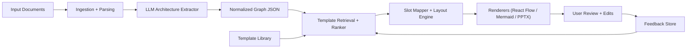

# Architecture Design Library: Full Implementation Plan

## 1. Objective

Build a production-ready system that:

1. Maintains a reusable library of architecture design patterns (starting from `/Users/rgambhir/Architecture Library.pptx`).
2. Reads incoming documents (PPTX, PDF, DOCX, TXT/MD, images where possible).
3. Extracts architecture components and relationships.
4. Selects the best matching design pattern automatically.
5. Generates a final diagram in the selected style with minimal manual edits.

---

## 2. Scope

### In Scope

1. Template ingestion from PowerPoint library.
2. Structured template metadata + slot definitions.
3. Document extraction into normalized architecture graph JSON.
4. Template ranking and selection with confidence scoring.
5. Slot mapping from extracted graph to template layout.
6. Layout/render rules (compact spacing, container separation, box-like shapes, optional 3D cylinders).
7. Human review loop for low-confidence cases.
8. Feedback capture to improve future selection accuracy.

### Out of Scope (Phase 1)

1. Fully autonomous updates to template geometry without review.
2. Fine-grained icon-level brand packs for every vendor logo.
3. Multi-language OCR optimization beyond English.

---

## 3. Success Criteria (KPIs)

1. `>=85%` top-1 template selection accuracy on validation set.
2. `>=90%` of generated diagrams require only minor text edits (no major layout rebuild).
3. P95 generation latency under `20s` for docs under 30 pages/slides.
4. `>=95%` render validity (no overlapping containers, no clipped labels).
5. User rating average `>=4/5` on "matches intended architecture style."

---

## 4. Target System Architecture



---

## 5. Core Data Contracts

### 5.1 Template Schema (`DesignTemplate`)

```json
{
  "templateId": "layered-core-workers-integration-v1",
  "name": "Layered App + Workers + Integration",
  "tags": ["layered", "workers", "integration", "enterprise"],
  "version": "1.0.0",
  "visual": {
    "theme": "wm-enterprise-blue",
    "nodeStyles": {
      "service": "box",
      "database": "cylinder-3d",
      "queue": "box"
    },
    "layoutRules": {
      "columnGapPx": 72,
      "containerGapPx": 24,
      "compactMode": true
    }
  },
  "slots": [
    {"slotId": "presentation", "type": "service", "required": true, "maxItems": 1},
    {"slotId": "application", "type": "service", "required": true, "maxItems": 1},
    {"slotId": "dataStores", "type": "database", "required": true, "maxItems": 4},
    {"slotId": "backgroundWorkers", "type": "worker", "required": false, "maxItems": 3},
    {"slotId": "integrations", "type": "external", "required": false, "maxItems": 8}
  ]
}
```

### 5.2 Extracted Architecture Graph (`ArchitectureGraph`)

```json
{
  "title": "Product Architecture",
  "components": [
    {"id": "presentation", "label": "Presentation Layer", "kind": "service"},
    {"id": "application", "label": "Application Layer", "kind": "service"},
    {"id": "sql", "label": "SQL Server", "kind": "database"},
    {"id": "redis", "label": "Redis Cache", "kind": "database"}
  ],
  "edges": [
    {"source": "presentation", "target": "application", "type": "api", "label": "REST API"},
    {"source": "application", "target": "sql", "type": "data"},
    {"source": "application", "target": "redis", "type": "data"}
  ],
  "metadata": {
    "domains": ["commerce"],
    "confidence": 0.88
  }
}
```

### 5.3 Selection Result (`TemplateSelectionResult`)

```json
{
  "selectedTemplateId": "layered-core-workers-integration-v1",
  "confidence": 0.91,
  "alternatives": [
    {"templateId": "layered-simple-v1", "score": 0.82},
    {"templateId": "event-driven-pipeline-v1", "score": 0.64}
  ],
  "reasoning": {
    "tagMatch": 0.9,
    "shapeMatch": 0.86,
    "slotCoverage": 1.0
  }
}
```

---

## 6. Implementation Workstreams

## Workstream A: Template Library Ingestion

### Goals

1. Convert `Architecture Library.pptx` slides into reusable templates.
2. Capture both visual style and semantic slot structure.

### Tasks

1. Build PPTX parser utility to read slide shapes/positions/text blocks.
2. Define `DesignTemplate` JSON schema and validator.
3. Build template normalizer:
   1. Deduplicate style tokens.
   2. Normalize container and slot naming.
4. Add manual curation UI to finalize slot labels and tags.
5. Persist templates in `templates/*.json`.

### Deliverables

1. `template-schema.json`
2. `scripts/ingest-pptx-templates.ts`
3. `template-catalog.json`
4. 10-30 initial curated templates

---

## Workstream B: Document Ingestion + Architecture Extraction

### Goals

1. Normalize mixed document inputs into extractable text and structure.
2. Produce `ArchitectureGraph` with stable component kinds and edge types.

### Tasks

1. File routing by type: `pdf`, `pptx`, `docx`, `txt/md`, `images`.
2. Chunking strategy per document section/slide.
3. LLM extraction prompt + schema-constrained output.
4. Entity resolver:
   1. Merge duplicates (`API`, `REST API`, `App API`).
   2. Normalize kinds (`db`, `rds`, `postgres` -> `database`).
5. Confidence scoring at component and edge level.

### Deliverables

1. `extractor/parse.ts`
2. `extractor/extract-graph.ts`
3. `extractor/normalize-graph.ts`
4. Evaluation set with expected graph outputs

---

## Workstream C: Template Selection Engine

### Goals

1. Choose the best template for each extracted graph.
2. Provide alternatives when confidence is low.

### Tasks

1. Create template embeddings from tags + slot signatures.
2. Create graph signature vector from extracted architecture.
3. Implement multi-factor scoring:
   1. Semantic similarity score.
   2. Slot coverage score.
   3. Structural compatibility score.
   4. Penalties for missing required slots.
4. Threshold policy:
   1. Auto-select when confidence >= threshold.
   2. Show top 3 when confidence < threshold.

### Deliverables

1. `selector/rank-templates.ts`
2. `selector/score.ts`
3. `selector/policy.ts`

---

## Workstream D: Slot Mapping + Layout Engine

### Goals

1. Map components to template slots consistently.
2. Enforce strict visual layout rules.

### Tasks

1. Implement slot mapper:
   1. Required slots first.
   2. Overflow handling for optional slots.
2. Implement layout rules:
   1. Preserve major container spacing.
   2. Keep compact spacing within containers.
   3. Keep box-like rectangles.
   4. 3D cylinder top/side style for databases.
3. Collision checks:
   1. Container overlap detection.
   2. Label clipping prevention.
4. Add post-layout auto-adjust pass for long labels.

### Deliverables

1. `layout/slot-map.ts`
2. `layout/layout-rules.ts`
3. `layout/validate-layout.ts`

---

## Workstream E: Rendering Layer

### Goals

1. Render consistent outputs across formats.

### Tasks

1. React Flow renderer adapter from mapped layout.
2. Mermaid exporter.
3. Optional PPTX export renderer for business users.
4. Theme enforcement (colors, node borders, spacing).

### Deliverables

1. `renderers/react-flow.ts`
2. `renderers/mermaid.ts`
3. `renderers/pptx.ts` (optional in Phase 2)

---

## Workstream F: Human-in-the-Loop + Feedback

### Goals

1. Let users quickly correct template choice and mapping.
2. Feed corrections back into ranking improvements.

### Tasks

1. UI for "Choose alternate template" from top candidates.
2. Slot remap controls with drag/drop or dropdown assignment.
3. Save accepted result + manual edits as training events.
4. Re-ranking update job using feedback history.

### Deliverables

1. `feedback/events.ts`
2. `feedback/retrain-ranker.ts`
3. UI components for candidate selection/remapping

---

## 7. Proposed Repository Additions

```text
plan/
  design-library-implementation-plan.md

src/
  templates/
    schema/template-schema.json
    catalog/template-catalog.json
    curated/*.json
  extractor/
    parse.ts
    extract-graph.ts
    normalize-graph.ts
  selector/
    rank-templates.ts
    score.ts
    policy.ts
  layout/
    slot-map.ts
    layout-rules.ts
    validate-layout.ts
  renderers/
    react-flow.ts
    mermaid.ts
    pptx.ts
  feedback/
    events.ts
    retrain-ranker.ts
```

---

## 8. API Layer (Suggested)

1. `POST /api/templates/ingest`  
   Input: PPTX path/file  
   Output: extracted template candidates

2. `POST /api/architecture/extract`  
   Input: source documents  
   Output: normalized architecture graph

3. `POST /api/diagram/generate`  
   Input: graph + optional template override  
   Output: rendered diagram payload

4. `POST /api/feedback`  
   Input: selected template, edits, acceptance signal  
   Output: ack + event id

---

## 9. Testing and Evaluation Plan

### Unit Tests

1. Template schema validation.
2. Graph normalization and entity merging.
3. Ranking score component calculations.
4. Slot mapping deterministic behavior.

### Integration Tests

1. End-to-end from docs to rendered diagram.
2. Low-confidence branch returns top candidates.
3. Layout validation catches overlap and clipping.

### Golden Dataset

1. 50-100 representative architecture docs.
2. Ground-truth template + expected slot mapping.
3. Weekly regression run with KPI report.

---

## 10. Delivery Phases and Timeline

## Phase 0 (Week 1): Foundation

1. Define schemas (`DesignTemplate`, `ArchitectureGraph`).
2. Set up test fixtures and evaluation harness.
3. Import and inspect `Architecture Library.pptx`.

## Phase 1 (Weeks 2-3): Template Library MVP

1. Build PPTX ingestion.
2. Produce first curated template catalog.
3. Add template validator and preview utility.

## Phase 2 (Weeks 4-5): Extraction + Selection MVP

1. Ship architecture graph extraction pipeline.
2. Implement ranker and confidence policy.
3. Return top 3 template candidates when uncertain.

## Phase 3 (Weeks 6-7): Mapping + Rendering

1. Slot mapper and layout rules.
2. Render React Flow and Mermaid outputs.
3. Add layout validator and repair pass.

## Phase 4 (Week 8): Feedback + Hardening

1. Add user feedback loop and event storage.
2. Run accuracy/latency tuning.
3. Production readiness checklist and launch.

---

## 11. Risks and Mitigations

1. **Risk:** Template mismatch due to ambiguous docs.  
   **Mitigation:** confidence threshold + top candidate review UI.

2. **Risk:** Extraction hallucinations.  
   **Mitigation:** schema-constrained output + rule-based normalization + validation.

3. **Risk:** Layout collisions with long labels.  
   **Mitigation:** label wrapping, dynamic node sizing, post-layout collision pass.

4. **Risk:** Drift between styles and curated templates.  
   **Mitigation:** template versioning + periodic catalog audit.

---

## 12. Operational Readiness Checklist

1. Observability:
   1. extraction errors
   2. ranking confidence distribution
   3. generation latency
2. Auditability:
   1. save prompt, selected template, output graph, and edits
3. Rollback:
   1. template version pinning
   2. ranker model version pinning
4. Security:
   1. file upload constraints
   2. PII scrubbing in logs

---

## 13. First Milestone Definition (Practical MVP)

Ship a first milestone that can:

1. ingest the architecture PPTX into at least 10 curated templates,
2. parse incoming docs into an architecture graph,
3. auto-select a template with confidence scoring,
4. generate a usable React Flow diagram with enforced container separation and compact styling.

This milestone is enough to validate product value with real user docs before expanding to advanced exports and automated learning loops.

