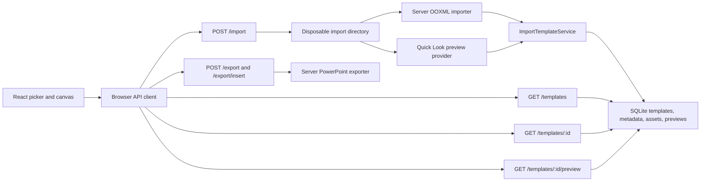

# Server API, Template Preview, and Picker Integration Plan

## Goal

Make the Express server the authoritative PowerPoint import/export boundary, generate and persist a
first-slide PNG preview during import, expose the stored template catalog through the API, and make
both picker pages load and select templates from that catalog.

The frontend and backend must remain independently buildable and deployable. Their only integration
boundary is documented HTTP requests and JSON/binary responses; they must not share TypeScript
types, source modules, workspace packages, or runtime imports.

The migration must remove active duplicate PowerPoint implementations without making ignored
temporary files part of the build. Existing browser canvas behavior, the compact canvas JSON
contract, imported image assets, template IDs, element order, and existing API response bodies must
remain stable unless an explicit contract change is listed below.

## Assumptions and decisions

- The unfinished phrase "put the plan in" is interpreted as the repository's `plan/` directory.
- The requested root temporary folder will be `tmp/powerpoint-legacy/`, relative to the repository
  root, and `.gitignore` will contain `/tmp/`. It is a migration safety copy only. No source,
  package script, test, or runtime import may depend on it.
- Server and frontend types will use different domain names even when their serialized fields must
  match. Each side validates untrusted HTTP data at its own boundary instead of importing the
  other side's definitions.
- `/import`, `/export`, and `/templates` remain the public server paths. The browser will reach them
  through one configurable API client; a Vite development proxy can provide same-origin `/api/*`
  URLs without enabling permissive CORS.
- Quick Look generates only the first-slide preview. Multi-slide previews and the
  LibreOffice/PDF/`pdftoppm` flow are out of scope for this release.
- Preview generation is best effort. A valid deck still imports if Quick Look is unavailable or
  cannot render it; the stored template then has `previewUrl: null`, the import reports a safe
  preview status, and the picker shows a fallback. This keeps the API usable on non-macOS hosts.
- Imported templates default to the `diagram` kind for backward compatibility. A validated import
  query parameter selects `diagram` or `commentary` when the caller knows the destination picker.
- The current bare canvas-JSON body returned by `POST /import` and
  `GET /templates/:templateId` remains unchanged. Picker metadata is returned by `GET /templates`.

## Current repository findings

- The in-progress workspace migration already puts Node import code in `server/src/lib/import/`,
  server export code in `server/src/lib/export/`, and SQLite-backed routes under `server/src/`.
- `POST /import`, `POST /export`, `GET /templates`, `GET /templates/:templateId`, template asset
  retrieval, and template deletion already exist.
- `web/src/lib/export/` and `server/src/lib/export/` are similar but have materially diverged. The
  browser copy also contains browser-only download/file-handle and existing-deck insertion logic.
  It must not be overwritten wholesale with either version.
- `web/src/lib/shared/` and `server/src/lib/shared/` have also diverged. The browser SVG canvas still
  imports normalized slide types, constants, layering, and normalization from the browser copy.
  Those trees should become separately named frontend canvas code and backend PowerPoint code, not
  a shared package.
- Both picker pages are currently backed by bundled arrays. Their preview images and template JSON
  are compiled into the Vite bundle.
- `modelSelector.ts` and `diagramGenerator.ts` also read the bundled diagram array, so changing only
  the visible picker would leave the upload-only flows on a different catalog.
- `TemplateCanvasPage.tsx` and `JsonInputPage.tsx` still generate PowerPoint files in the browser.
  Removing the browser exporter therefore requires API integration for both new-deck export and
  insertion into an existing deck.
- There are server API and PowerPoint parity tests, but no focused tests for the picker pages or API
  client today.

## Target architecture



### Source ownership after migration

| Location | Ownership |
| --- | --- |
| `server/src/lib/import/` | OOXML reading, ZIP/XML handling, compact JSON conversion; Node only. |
| `server/src/lib/export/` | PPTX rendering, theming, and existing-deck insertion; Node only. |
| `server/src/lib/shared/` | Backend-only PowerPoint normalization and domain types. Despite its current folder name, it is not shared with the frontend. Rename it to `server/src/lib/presentation/` when import churn is manageable. |
| `server/src/services/` | Import/export orchestration, staging, preview generation, validation, and cancellation. |
| `web/src/lib/api/` | Frontend-only fetch adapters, independently named response DTOs, runtime response validation, URL construction, download/file-handle writes, and abort handling. |
| `web/src/lib/canvas-model/` | Frontend-only canvas JSON, normalized element types, and deterministic rendering helpers. It does not reuse backend PowerPoint type names. |
| `web/src/lib/slide-canvas/` and `web/src/lib/slide-svg/` | Browser rendering and editing only, using the frontend canvas model. |
| `tmp/powerpoint-legacy/` | Ignored migration backup; never a source of truth. |

Import/export execution belongs in `server/`. The browser must not import anything from `server/`,
including type-only imports, and the server must not import anything from `web/`. Do not introduce a
third shared-contract workspace. The JSON format is an external wire protocol, not a shared
in-process model.

## Frontend/backend type separation

Use deliberately different names so a cross-boundary import is conspicuous during review:

| Backend-only name | Frontend-only name | Boundary behavior |
| --- | --- | --- |
| `PowerPointCanvasJson` | `CanvasDocument` | Frontend parses an `unknown` JSON response into its local canvas document. |
| `NormalizedPresentation` | `EditableCanvasPresentation` | Each runtime normalizes for its own renderer independently. |
| `NormalizedSlide` | `EditableCanvasSlide` | Equivalent serialized fields do not imply shared TypeScript identity. |
| `NormalizedElement` | `EditableCanvasElement` | Each side owns its own discriminated union. |
| `TemplateListItem` | `PickerTemplateSummary` | Frontend validates each list record returned over HTTP. |
| `TemplateListResponse` | `PickerTemplateCatalog` | Frontend does not cast `response.json()` to the server type. |
| `GeneratedTemplatePreview` | `PreviewImageResponse` | Backend owns stored bytes; frontend owns browser URL/loading state. |

The server may keep its existing PowerPoint-oriented names to limit churn. Move the frontend's
current `web/src/lib/shared/PowerpointTypes.ts` consumers to frontend-specific files and names. A
frontend validator should accept `unknown`, validate the required wire fields, and return frontend
models. Compatibility is enforced with request-level tests and committed JSON examples owned by
each test suite, not through shared TypeScript declarations or generated types.

## API contract

### `POST /import?kind=diagram|commentary`

- Keep the raw PPTX request body and existing PowerPoint content type.
- Validate `kind`; default it to `diagram` when omitted.
- Keep the current `201` canvas-JSON body and existing `Location`, `X-Template-Id`, and warning
  headers.
- Add `X-Template-Preview-Status: ready|unavailable` and a `Link` preview relation when ready.
- Generate the preview before the staged PPTX is deleted.
- Persist template JSON, metadata, extracted assets, and the preview in one database transaction.

### `GET /templates?kind=diagram|commentary`

Return newest-first lightweight records. Preserve current fields and add the fields the pickers
need:

```json
{
  "templates": [
    {
      "templateId": "template-123",
      "kind": "diagram",
      "title": "Imported architecture",
      "description": "Imported PowerPoint template",
      "slideCount": 1,
      "elementCount": 24,
      "previewUrl": "/templates/template-123/preview"
    }
  ]
}
```

- `previewUrl` is `string | null`.
- Reject an unknown `kind` with the existing safe error envelope.
- Do not include template JSON, image BLOBs, preview BLOBs, filenames, or local paths in the list.

### `GET /templates/:templateId/preview`

- Return the PNG BLOB with `Content-Type: image/png`, exact `Content-Length`,
  `X-Content-Type-Options: nosniff`, and a privacy-preserving cache policy.
- Return `404 template_not_found` when the template is absent and
  `404 template_preview_not_found` when the template exists without a preview.
- Keep the route before `/:templateId` and add an explicit `405` handler for wrong methods.

### Existing template routes

- Keep `GET /templates/:templateId` as the hydrated canvas JSON response used by the canvas and
  model-generation flows.
- Keep `GET /import/:templateId` as the compatibility alias until callers are migrated.
- Deletion must cascade to template assets, metadata, and preview data.

### Export routes

- Keep `POST /export` as JSON-to-new-PPTX and use it from `JsonInputPage` and the canvas's
  "Export" action.
- Add `POST /export/insert` for adding generated slides to an uploaded target PPTX. Use bounded
  multipart input with fields for `presentation`, `target`, and `insertAfterSlide`; return the
  edited PPTX as a download.
- Parse multipart with a directly declared streaming dependency rather than base64-encoding the
  target deck into JSON. Bound each part, total bytes, field count, expanded ZIP bytes, and JSON
  complexity.
- The server cannot directly overwrite a browser-local file. For "overwrite", the browser may
  write the returned bytes through an already-authorized File System Access handle; all OOXML
  manipulation still happens on the server.

## Persistence design

Introduce explicit SQLite schema migrations instead of relying only on `CREATE TABLE IF NOT EXISTS`.
Use `PRAGMA user_version` or an equivalent version table so an existing local database upgrades
without being deleted.

Recommended additions:

```sql
CREATE TABLE template_metadata (
  template_id TEXT PRIMARY KEY,
  kind TEXT NOT NULL CHECK (kind IN ('diagram', 'commentary')),
  description TEXT NOT NULL,
  source TEXT NOT NULL CHECK (source IN ('builtin', 'import')),
  created_at TEXT NOT NULL,
  FOREIGN KEY (template_id) REFERENCES templates(template_id) ON DELETE CASCADE
) STRICT;

CREATE TABLE template_previews (
  template_id TEXT PRIMARY KEY,
  content_type TEXT NOT NULL CHECK (content_type = 'image/png'),
  preview_data BLOB NOT NULL CHECK (length(preview_data) > 0),
  width INTEGER NOT NULL CHECK (width > 0),
  height INTEGER NOT NULL CHECK (height > 0),
  FOREIGN KEY (template_id) REFERENCES templates(template_id) ON DELETE CASCADE
) STRICT;
```

- Backfill existing template rows as `diagram`, `source = 'import'`, with an empty/default
  description and no preview.
- Extend `TemplateRepository` with typed metadata/preview records, filtered listing,
  `findPreview`, and transactional insert/update methods.
- Validate PNG signature, IHDR dimensions, dimensions no greater than the configured limit, and a
  maximum stored byte count before insertion.
- Avoid loading preview BLOBs in list queries. Use an existence join to construct `previewUrl`.

## Quick Look preview provider

Add an injected boundary such as:

```ts
type GeneratedTemplatePreview = {
  bytes: Buffer
  contentType: 'image/png'
  width: number
  height: number
}

interface TemplatePreviewGenerator {
  generate(inputPath: string, outputDirectory: string, signal?: AbortSignal):
    Promise<GeneratedTemplatePreview | undefined>
}
```

Implementation requirements:

1. The import orchestrator creates one disposable directory and writes a generated filename such as
   `upload.pptx`.
2. The existing OOXML converter reads that path rather than creating a second temporary directory.
3. After successful conversion, the Quick Look provider runs
   `/usr/bin/qlmanage -t -s 1600 -o <preview-directory> <input-path>` without a shell.
4. Use generated absolute paths, a fixed executable, a short timeout, request abort propagation,
   bounded captured output, and child termination on cancellation.
5. Read only the PNG created inside the dedicated preview directory. Reject symlinks, unexpected
   file counts, non-PNG bytes, invalid IHDR values, or oversized output.
6. Return `undefined` for configured/unavailable best-effort preview failures and add one sanitized
   import warning; do not expose command output or local paths.
7. The orchestrator externalizes embedded images and performs the database transaction only after
   conversion and preview attempt complete.
8. Remove the entire staging directory in `finally`, including database failures, timeouts, and
   client disconnects.

Add server configuration for preview provider (`quicklook` or `disabled`), render size, timeout,
and maximum PNG bytes. Default to Quick Look only when the configured executable is available;
otherwise start in disabled mode and expose the state through safe startup diagnostics. Do not
pretend this is portable to Linux.

## Built-in catalog migration

The current diagram and commentary pickers must not go empty when their bundled arrays are removed.
Move the checked-in template JSON and preview images to a server-owned catalog directory, with a
small manifest containing stable ID, kind, title, description, and asset paths.

- Seed built-ins transactionally and idempotently at server startup or through an explicit seed
  command invoked before serving.
- Preserve current stable IDs because model selection output and tests refer to them.
- Store the existing preview PNGs directly; do not run Quick Look for assets that already have a
  reviewed preview.
- Do not overwrite a user-edited/imported template on every startup. Track `source = 'builtin'` and
  a manifest version/checksum before updating a seed.
- Move bundled picker JSON/images out of the Vite module graph only after the server catalog and
  browser fallback states are verified.

## Browser API layer

Create one module under `web/src/lib/api/` that owns:

- API base URL resolution;
- frontend-only DTOs such as `PickerTemplateSummary`, `PickerTemplateCatalog`, and
  `TemplateApiError`, with no matching import from the server;
- `listTemplates(kind, signal)`;
- `getTemplate(templateId, signal)`;
- `importTemplate(file, kind, signal)`;
- `exportPresentation(json, signal)`;
- `insertPresentation(json, targetFile, insertAfterSlide, signal)`;
- validation of response status, content type, metadata shape, and error envelopes;
- converting a returned PPTX response to a browser download or writing it to an authorized handle;
  and
- converting the API's relative `previewUrl` into a URL under the configured API base.

Every JSON response starts as `unknown`. The frontend adapter validates it and constructs its own
types; it must not use `response.json() as ServerType`, copy a backend type declaration verbatim, or
generate frontend types from server source. The server independently validates requests into its
own command/input types before invoking services.

Use a same-origin `/api` prefix in the browser. Configure the Vite development server to proxy and
rewrite `/api/*` to the local Express server. Document the matching production reverse-proxy
requirement. If a cross-origin deployment is required later, add an explicit origin allowlist to
Express rather than allowing every origin.

Use a discriminated async state for list/loading/error/ready, pass `AbortSignal` to fetch, ignore
stale selection responses, and never log template JSON, uploaded filenames, or document content.

## Picker integration

Extract the duplicated wheel/preview UI into a reusable `TemplatePicker` presentation component,
while keeping diagram- and commentary-specific orchestration in their pages.

For both picker pages:

1. Load `GET /templates?kind=<page-kind>` when the route mounts.
2. Show loading, empty, error with retry, ready, preview-image failure, and selection-loading states.
3. Clamp/reset `activeIndex` when the API result changes; use `templateId`, not title/name, as the
   React key and selection identity.
4. Render `previewUrl` in a normal `` with useful alt text and a deterministic fallback when it
   is null or fails to load.
5. Build related-template thumbnails from the returned list.
6. On "Generate Slide", fetch `GET /templates/:templateId`, validate the canvas JSON response, and
   pass the loaded JSON plus list metadata into the existing app workflow.
7. Disable repeat selection while the template JSON or OpenAI generation is pending, cancel stale
   fetches, and preserve accessible status/error feedback and keyboard operation.

Update every hidden catalog consumer, not just the picker UI:

- `modelSelector.ts` must receive the loaded diagram candidates as an argument, fetch their preview
  images through the API client, and validate the selected ID against that same candidate array.
- `diagramGenerator.ts` must receive the same dynamic candidate catalog instead of importing
  `DIAGRAM_TEMPLATES`.
- `App.tsx` should own the current loaded template only while it spans picker/canvas routes. It
  should no longer create a bundled default template at module initialization; use an explicit
  `null | loaded` canvas state and route-safe loading/error behavior.
- Commentary normalization should occur once at the boundary. Seed built-in commentary JSON in its
  already-normalized form and avoid broad client-side ID deletion when loading an imported deck.

If template upload is exposed in the picker in this release, post the raw file to `/import` with
that page's kind, refresh the list, select the new template, and announce preview-unavailable status
without treating it as an import failure.

## Browser export integration and duplicate removal

Migrate export callers before deleting browser PowerPoint code:

1. Change `JsonInputPage` to send parsed JSON to `POST /export`, download the response filename,
   and surface the server's safe error envelope.
2. Change canvas "Export" to the same client method.
3. Change "Add Slide" to `POST /export/insert`. Preserve the existing insert position validation.
4. For direct overwrite, write returned bytes through the selected file handle. For copy mode,
   download the returned file.
5. Move browser-only response-download and file-handle helpers to `web/src/lib/api/download.ts`.
6. Keep branding expressed in the canvas JSON contract (`showBranding` and precise normalization),
   not as a second browser PPTX renderer.

After all callers use the server:

- move obsolete `web/src/lib/export/` generation/theming/OOXML modules to
  `tmp/powerpoint-legacy/web-export/` and remove their tracked versions;
- move superseded duplicate shared implementations to
  `tmp/powerpoint-legacy/shared/` only after `rg` proves no active imports;
- replace the frontend's old PowerPoint-named shared types with independently named canvas models
  under `web/src/lib/canvas-model/`; do not copy or re-export server type declarations;
- keep or relocate browser-only asset resolution and JSON branding helpers under names that do not
  imply PowerPoint file generation;
- move the previous root import copy, if still present in the implementation branch, to
  `tmp/powerpoint-legacy/root-import/`;
- use the reviewed `server/src/lib/import/` and `server/src/lib/export/` versions as the canonical
  implementations rather than bulk-copying the divergent browser files over them; and
- run `git ls-files tmp` and require empty output. Git history, not `tmp/`, remains the durable
  backup.

## Implementation sequence

### Phase 1: Stabilize ownership and contracts

- Record the current dirty-worktree baseline and do not discard the existing workspace migration.
- Add `/tmp/` to `.gitignore` and create the local quarantine directory.
- Inventory imports and classify each old module as backend-only, frontend-only, or obsolete.
- Define separately named backend request/response/domain types and frontend API/canvas types.
- Add independent runtime validation on both sides of HTTP; do not add a shared package or shared
  generated types.
- Run focused typechecks/tests before moving any old implementation into `tmp/`.

### Phase 2: Complete the server PowerPoint boundary

- Port and adapt existing-deck insertion into the server exporter.
- Add the bounded `/export/insert` route and request tests.
- Refactor conversion so one service owns the staged PPTX lifetime.
- Pass request cancellation through handlers, services, the importer, and child processes.

### Phase 3: Add metadata, preview persistence, and preview generation

- Add schema migrations, metadata/preview repository methods, and cascade behavior.
- Add injected Quick Look and disabled preview providers.
- Generate/validate the PNG during import and store all import artifacts transactionally.
- Add preview and filtered-list routes, documentation, and tests.

### Phase 4: Move the built-in catalog behind the API

- Create the server catalog manifest and seed the current diagram/commentary templates.
- Verify stable IDs, JSON, counts, descriptions, and preview images through the real API.
- Keep bundled web assets only as a short-lived fallback until the next phase passes.

### Phase 5: Integrate the browser

- Add the typed API client, dev proxy, request cancellation, and download helpers.
- Convert both pickers and their model-selection/generation consumers to the API catalog.
- Convert new export, existing-deck insertion, and JSON-input export to server calls.
- Add focused browser tests and manually inspect both picker routes and canvas handoff.

### Phase 6: Quarantine duplicates and finish cleanup

- Use `rg` and both workspace typechecks to prove the legacy paths are unused.
- Move obsolete copies to ignored `tmp/powerpoint-legacy/` and remove tracked originals.
- Remove now-unused browser dependencies only after checking direct imports and lockfile impact.
- Update the root/server README with the API, macOS preview dependency, disabled fallback, proxy,
  configuration, and disposable smoke-test instructions.

## Test plan

### Server unit and repository tests

- Quick Look argument construction uses the fixed executable and no shell.
- Success reads the expected PNG; invalid signature, invalid dimensions, extra/symlink output,
  oversized output, timeout, abort, missing executable, and nonzero exit are handled safely.
- Temporary directories are removed on every result path.
- Schema migration upgrades an existing database and preserves its templates/assets.
- Template, metadata, assets, and preview insert atomically; deletion cascades.
- List filtering and preview existence do not load BLOB data.

Use a fake process runner for routine tests. Do not require Quick Look, PowerPoint, LibreOffice, or
the network in CI.

### Server request tests

- Import with a fake preview returns `201`, stores the preview, and advertises ready status.
- Import without a preview still returns `201` and lists `previewUrl: null`.
- Invalid kind, body type, body size, malformed PPTX, preview not found, template not found, wrong
  methods, request timeout, and disconnect behavior use stable sanitized responses.
- `GET /templates?kind=...` returns the exact metadata contract and newest-first ordering.
- `GET /templates/:id/preview` returns exact PNG headers/bytes.
- `POST /export/insert` covers valid insertion positions, malformed multipart data, target-deck
  validation, size limits, and binary response headers.
- Import JSON -> retrieve JSON -> export PPTX remains a round-trip test.

### Browser tests

- API client validates success/error content types and uses the configured base URL.
- API responses are treated as `unknown`; malformed records are rejected before becoming frontend
  `PickerTemplateSummary` or `CanvasDocument` values.
- Both pickers cover loading, empty, retry, ready, null preview, broken image, selection loading, and
  stale/cancelled requests.
- Selecting a template fetches its JSON and hands the correct ID/title/kind into the canvas flow.
- Model selector and diagram generator use the exact API candidate list and reject an unknown
  selected ID.
- JSON and canvas exports download returned PPTX bytes; insert and file-handle overwrite use the
  server response and prevent duplicate submissions.

### Verification commands

Run focused tests first, then the repository gates:

```sh
npm run test --workspace @tts-mermaid/server -- test/importApi.test.ts
npm run test --workspace @tts-mermaid/server -- test/exportApi.test.ts
npm run test --workspace @tts-mermaid/server -- test/powerPointParity.test.ts
npm run test --workspace @tts-mermaid/web -- src/path/to/picker-and-api-tests.test.tsx
npm run typecheck
npm test
npm run build
rg -n "from ['\"].*server/|from ['\"].*web/" web/src server/src
git diff --check
git status --short
```

The boundary `rg` command must return no cross-workspace imports. Also compare the server response
fixtures with frontend validator tests so JSON field drift fails tests even though no TypeScript
types are shared.

Also run one disposable macOS smoke test with a synthetic/non-sensitive PPTX and the real Quick Look
provider. Confirm the imported template appears in the correct picker, the 1600-wide preview is
sharp, selection loads the correct JSON, export downloads a valid PPTX, and deletion removes the
template and preview. Never aim the smoke test at a valuable source deck or a real `.env`.

## Definition of done

- Import/export OOXML logic executes only on the server; the browser contains only canvas/UI/API
  code and small file-download/file-handle adapters.
- Frontend and backend have differently named local types, no shared-type workspace, and no imports
  across `web/` and `server/` in either direction.
- HTTP payloads are independently validated by both runtimes, and request-level contract tests catch
  field-name or content-type drift.
- No active code or test imports an ignored `tmp/` path, and `git ls-files tmp` is empty.
- Import attempts the first-slide preview before deleting the temporary PPTX and never leaks local
  paths or tool output.
- SQLite stores previews separately, retrieves them through the dedicated endpoint, and deletes
  them with their template.
- Both picker pages, the model selector, and diagram generator use one API-backed catalog.
- All async UI states are usable and accessible, and missing previews degrade gracefully.
- New-deck and existing-deck exports use server endpoints without losing the current insert-order
  or authorized overwrite behavior.
- Focused tests, repository typecheck/tests/build, `git diff --check`, and hands-on picker/API smoke
  checks pass, with any environment-only skips reported explicitly.
