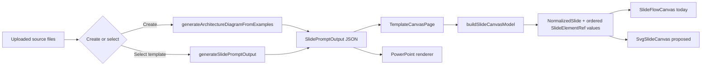
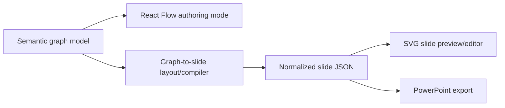

# Generate Diagram Canvas: React Flow vs. SVG

**Decision date:** 2026-08-18\
**Status:** Recommended for implementation, with parity gates\
**Scope:** The generated and template-based architecture diagram flows that currently render in `SlideFlowCanvas`

## Executive recommendation

Move the diagram canvas to the existing first-party `SvgSlideCanvas` and retire `SlideFlowCanvas` after a measured compatibility period.

Do **not** invest in a React Flow + per-node SVG hybrid for the current product. It would preserve React Flow's drag, resize, viewport, and accessibility conveniences, but it would still wrap each slide element in an HTML React Flow node. That leaves the application with two layout systems, makes whole-slide clipping and cross-element SVG behavior harder, and keeps a substantial dependency whose graph model is not being used.

This recommendation is specific to the product's current source of truth: a fixed-size PowerPoint-style slide document with absolute element geometry and ordered layers. If the product later becomes a semantic graph editor—users create connections from handles, relationships are stored as `source`/`target` edges, nodes auto-layout, and the graph is the source of truth—React Flow should be reconsidered for that separate authoring mode.

The suggested decision is therefore:

> **Go forward with one root SVG canvas for generated diagrams, but cut over only after diagram-specific visual, viewport, interaction, accessibility, and PowerPoint export gates pass. Keep React Flow as a temporary rollback path during the transition.**

## What was researched

The recommendation is based on:

- the current create-diagram and template-selection flows in `src/App.tsx` and `src/lib/diagramGenerator.ts`;
- the renderer-neutral model and mutation layer in `src/lib/slide-canvas/`;
- the current React Flow surface in `src/lib/slide-flow/`;
- the completed commentary SVG surface in `src/lib/slide-svg/`;
- all six checked-in architecture diagram JSON templates;
- the production bundle emitted by the current working tree;
- the current automated tests; and
- current React Flow and browser SVG documentation.

No production code was changed as part of this research. The working tree already contained uncommitted renderer work, so this report treats that work as the baseline and adds files only under `research/`.

## Current product architecture

Both the generated-diagram flow and the template-based diagram flow end at the same normalized slide contract:

Important implications:

1. The persisted value is slide JSON, not React Flow nodes and edges.
2. Element positions are already explicit `x`, `y`, `w`, and `h` values in a 1280-by-720 slide coordinate system.
3. The normalized model already supports shape, text, line, and image elements independently of either browser renderer.
4. PowerPoint export already consumes the slide model and does not require React Flow.
5. The existing React Flow canvas passes `edges={[]}`. Even PowerPoint connectors are modeled as draggable React Flow **nodes**, not React Flow edges.

That fifth point is the most important architectural signal: React Flow currently supplies interaction and viewport behavior, but the application does not use its central node-and-edge graph abstraction.

## Repository findings

### The generated output is a slide document, not a graph

`SlidePromptOutput` defines absolute slide geometry. Generated shapes and text have explicit bounds. The create prompt also tells the model to imply relationships through containment, adjacency, and row order rather than through connector lines.

There is a small contract inconsistency worth fixing during the migration:

- the response schema and TypeScript type still allow `line` elements;
- the generation prompt explicitly says not to create line elements; and
- `constrainSlideBounds()` silently removes every generated line.

This does not block the renderer decision, but the create-flow schema should say what the runtime actually accepts. Template-based diagrams must continue supporting lines because the checked-in templates contain them.

### All current architecture template primitives are already supported by SVG

The six checked-in architecture templates contain:

| Template | Elements | Shapes | Lines | Text | Shape names |
| --- | ---: | ---: | ---: | ---: | --- |
| Layered Platform | 21 | 15 | 3 | 3 | 13 `rect`, 2 `flowChartMagneticDisk` |
| Layered Architecture | 16 | 14 | 1 | 1 | 12 `rect`, 2 `flowChartMagneticDisk` |
| Microservice Architecture | 60 | 46 | 12 | 2 | 41 `rect`, 5 `flowChartMagneticDisk` |
| Multi-Application Ecosystem | 51 | 39 | 12 | 0 | 30 `rect`, 9 `flowChartMagneticDisk` |
| Product Architecture | 20 | 18 | 1 | 1 | 15 `rect`, 3 `flowChartMagneticDisk` |
| Multi-Tenant System | 24 | 13 | 7 | 4 | 11 `rect`, 2 `flowChartMagneticDisk` |
| **Total** | **192** | **145** | **36** | **11** | **122 `rect`, 23 `flowChartMagneticDisk`** |

The templates also contain 284 text runs, and 87 elements contain more than one run. Text fidelity is therefore a more important migration gate than shape coverage.

The current SVG registry already supports `rect`, `roundRect`, `ellipse`, `triangle`, `pie`, `diamond`, `chevron`, and `flowChartMagneticDisk`. It also has straight/elbow line paths, arrow markers, connector occlusion masks, images, mixed text runs, wrapping, shrink-to-fit, and an HTML editing overlay. The architecture templates require only a subset of those capabilities.

### The reusable core has already been extracted

The earlier commentary work removed the largest migration risk. Both renderers now share:

- `buildSlideCanvasModel()` for normalization and ordered element references;
- source-path-based element identity;
- immutable raw JSON editing and deletion;
- geometry and coordinate rounding;
- text-run rebuilding; and
- connector-aware layer order.

Changing the renderer therefore does not require a new JSON schema or a second mutation path. It is primarily a UI compatibility and visual-fidelity exercise.

### The current SVG interaction layer is close to diagram parity

`SvgSlideCanvas` already provides:

- single-element selection and background deselection;
- pointer-captured dragging;
- eight resize handles for box elements;
- line dragging and endpoint editing;
- delete/backspace;
- arrow-key movement, with Shift for a larger nudge;
- Enter/click/double-click text editing;
- Escape cancellation;
- slide-space pointer conversion through the SVG screen transformation matrix; and
- a single JSON commit on pointer-up rather than on every pointer move.

The significant remaining differences from React Flow are viewport pan/zoom, built-in focus traversal/live announcements, and possibly multi-selection/box selection depending on what users rely on today.

### React Flow has real strengths, but they are mostly framework strengths

React Flow's current APIs directly provide:

- draggable and selectable custom-node wrappers;
- `NodeResizer` controls;
- fit, pan, scroll/pinch zoom, coordinate extents, and visible-element rendering;
- keyboard focus, selection, movement, and screen-reader instructions; and
- semantic edges with custom SVG paths and markers.

Those are valuable capabilities. However, the current application uses custom wrappers and `NodeResizer`, but it does not use semantic React Flow edges, handles, graph traversal, or graph layout. The official custom-edge model requires a `source` and `target` node and renders an SVG path between them. Converting coordinate-defined PowerPoint lines into that model would change the document semantics and complicate round-tripping.

### React Flow is a measurable route cost

The current production build emits a lazy diagram-canvas chunk of approximately:

- **192.11 kB minified JavaScript / 62.67 kB gzip**; and
- **20.04 kB CSS / 3.42 kB gzip**.

That chunk includes `SlideFlowCanvas` and its React Flow dependencies, so it is not a pure library-size measurement. It is the relevant product measurement: after a full SVG cutover, this route chunk and stylesheet are candidates for removal. `SlideFlowCanvas.tsx` itself is currently 1,343 lines, whereas the SVG implementation separates rendering, text layout, interaction, selection, shapes, lines, images, and viewport behavior into focused modules.

The installed `@xyflow/react` version is 12.10.1. The package remains MIT-licensed. Licensing is not a reason to migrate; architecture fit, fidelity, maintenance, and bundle cost are.

## Options considered

### Option 1 — Keep the current React Flow renderer

**What it means:** Continue representing every slide element—including coordinate-defined connector lines—as a React Flow node, with a mixture of HTML boxes and nested SVG shapes.

**Advantages**

- Lowest immediate implementation effort.
- Mature pan/zoom, fit, drag, resize, selection, and keyboard behaviors.
- Lowest short-term regression risk because it is the current diagram path.
- Strong future fit if the product changes to semantic graph editing.

**Disadvantages**

- The renderer is not structurally aligned with the slide document.
- HTML text/box layout and PowerPoint/SVG geometry can diverge.
- Connector lines remain fake nodes; React Flow edge features do not apply.
- Whole-slide clipping, layer order, masks, and portable serialization cross HTML/SVG boundaries.
- The app maintains two renderers indefinitely.
- It retains the additional diagram-route bundle and React Flow-specific CSS/state behavior.

**Conclusion:** Safe as a temporary rollback path, but not the preferred end state.

### Option 2 — Keep React Flow and render each node as SVG

**What it means:** Replace the HTML contents of each React Flow node with a small SVG for that shape or text block while React Flow continues to own each element's outer position, drag, selection, and resize.

**Advantages**

- Reuses the SVG shape primitives.
- Keeps React Flow viewport, selection, keyboard, and resizing features.
- Can incrementally improve shape fidelity without changing the canvas shell.

**Disadvantages**

- Each element gets an isolated SVG coordinate system inside an HTML wrapper; it is not one editable slide SVG.
- Cross-element SVG features—one root clip, masks, shared definitions, connector occlusion, and exact DOM layer order—remain harder.
- Text editing still crosses SVG, HTML node wrappers, and the React Flow transform.
- PowerPoint lines must still be modeled as fake nodes or translated to source/target edges.
- The app retains both React Flow state and slide JSON state, plus synchronization code between them.
- It keeps essentially all of React Flow's route and maintenance cost.
- A one-node React Flow wrapper around the whole SVG is not better: element interactions would still be custom, so React Flow would be retained mostly for pan/zoom.

**Conclusion:** Technically viable, but it captures the costs of both approaches without delivering a single slide-native rendering model. Do not pursue for the current requirements.

### Option 3 — Use one root SVG canvas

**What it means:** Render the normalized slide as one `<svg viewBox="0 0 width height">`, one ordered `<g>` per element, and a temporary absolutely positioned HTML editor only while text is actively edited.

**Advantages**

- Direct mapping from normalized slide coordinates to browser geometry.
- One coordinate system for rendering, hit testing, resizing, clipping, masks, connector occlusion, and selection.
- Natural DOM order for PowerPoint-like layering.
- Shared primitives across commentary and architecture diagrams.
- One renderer, one mutation layer, and one visual test strategy.
- Removes the React Flow route chunk after the compatibility period.
- Creates a straightforward path to future SVG/PNG preview export, although that should remain a separate feature.

**Disadvantages**

- The app owns pan/zoom, focus navigation, selection semantics, and accessibility announcements.
- SVG text wrapping is not automatic, so the custom text layout engine remains a critical subsystem.
- Visual parity must be proven across the denser diagram templates, especially the 60-element microservice slide.
- If semantic graph authoring becomes a core requirement, some React Flow capabilities would need to be rebuilt or reintroduced in another mode.

**Conclusion:** Best fit for the current fixed-slide editor and the recommended end state.

## Decision matrix

Ratings are relative to the current goal: edit a fixed-layout slide JSON and export the same document as native PowerPoint elements.

| Criterion | Current React Flow | React Flow + SVG nodes | Root SVG canvas |
| --- | --- | --- | --- |
| Matches current slide JSON | Weak | Medium | **Strong** |
| Browser/PowerPoint geometry parity | Medium | Medium | **Strong** |
| Whole-slide clipping and layer control | Weak | Medium | **Strong** |
| Drag/resize/pan/zoom out of the box | **Strong** | **Strong** | Medium |
| Accessibility out of the box | **Strong** | **Strong** | Medium |
| Reuses completed commentary work | Weak | Medium | **Strong** |
| Bundle/dependency simplicity | Weak | Weak | **Strong** |
| Semantic graph-editor future | **Strong** | **Strong** | Weak |
| Current-system maintainability | Weak | Weak | **Strong** |

The result changes only if semantic graph editing becomes more important than fixed-slide fidelity. That is not how the current JSON, generation prompt, renderer, or PowerPoint export path is designed.

## Why one root SVG is the right abstraction

An SVG `viewBox` maps a fixed user-space rectangle to a responsive viewport. That is almost exactly the relationship between the 1280-by-720 slide coordinates and the browser canvas. The browser can scale the entire slide while all element geometry remains in slide units.

The existing code also uses the right low-level browser primitives:

- `getScreenCTM().inverse()` converts pointer positions back into slide coordinates;
- pointer capture keeps drag/resize gestures active outside small handles;
- `<text>`/`<tspan>` keep display text inside the SVG graphics tree; and
- the HTML editor is overlaid only during editing, avoiding permanent `<foreignObject>` content.

The custom text layout engine is necessary whichever canvas shell is chosen. Native SVG text does not wrap by default, and SVG-per-ReactFlow-node does not remove that problem.

## Go-forward implementation plan

### Phase 0 — Lock diagram baselines and product requirements

1. Capture approved 1280-by-720 screenshots for all six architecture templates using the current React Flow renderer.
2. Export each template to PowerPoint and render the exported slides to images. Treat those exports—not React Flow alone—as the fidelity reference.
3. Record which current behaviors are actually required:
   - pan and zoom;
   - fit/reset;
   - multi-select and selection box;
   - group drag/delete;
   - touch/pinch interaction;
   - keyboard focus traversal; and
   - screen-reader announcements.
4. Add a representative generated-diagram fixture from the create flow, with sensitive source content removed if necessary.
5. Decide whether the branded frame should appear in the browser diagram preview. `SvgSlideCanvas` currently adds it for every slide, whereas the React Flow diagram preview does not appear to add an equivalent layer. The browser preview and PowerPoint export should agree intentionally.

**Exit gate:** Approved React Flow and PowerPoint visual references exist, and the interaction/accessibility parity list is explicit.

### Phase 1 — Add diagram compatibility coverage to the SVG renderer

1. Parameterize `SvgSlideCanvas` only where the diagram path genuinely differs, such as optional branding. Do not fork a second diagram SVG renderer.
2. Add component tests that render all six diagram templates through `SvgSlideCanvas` and assert:
   - every normalized element has one stable keyed group;
   - all shapes are supported;
   - line paths and arrow markers are present;
   - connector masks/occlusion rectangles are applied;
   - rich text produces expected run segments; and
   - no unsupported-shape diagnostic is present.
3. Add screenshot tests for all six templates at 1280-by-720 and at one smaller responsive viewport.
4. Compare the densest templates first: Microservice Architecture and Multi-Application Ecosystem.
5. Test all 284 text runs, with focused baselines for multi-line labels and mixed font sizes.

**Exit gate:** All six templates render without unsupported elements, missing labels, incorrect line order, or slide-boundary leakage.

### Phase 2 — Close interaction, viewport, and accessibility gaps

1. Add a small `useSvgViewport` layer with:
   - fit-to-container;
   - toolbar zoom in/out/reset;
   - wheel/pinch zoom around the pointer;
   - background pan; and
   - reasonable min/max zoom limits matching the current experience.
2. Keep slide geometry separate from viewport state. Apply viewport transforms to an outer SVG group and continue converting interactions to slide coordinates.
3. If Phase 0 confirms multi-selection is used, change `selectedKey` to a stable set of keys and add Shift-click, selection-box, group drag, and group delete. If it is not used, document single-selection as the supported behavior instead of recreating it speculatively.
4. Add focus traversal between elements, visible focus state, Enter/Space selection, Escape clearing, and live movement/deletion announcements. Preserve current arrow-key nudging.
5. Test mouse, touch/pointer, keyboard-only, and reduced-motion behavior.

**Exit gate:** The agreed interaction list works in SVG, including keyboard-only operation, without committing JSON during intermediate pointer movement.

### Phase 3 — Run PowerPoint and performance parity

1. For every fixture, perform drag, resize, text edit, line endpoint edit, add shape, add database, add straight/elbow line, delete, and clear-lines operations.
2. After each mutation, verify the JSON panel changed only at the selected source path.
3. Export the edited JSON to a new PowerPoint and insert it into an existing PowerPoint in both copy and overwrite modes.
4. Render exported slides and compare them with the SVG preview. Focus review on:
   - text wrapping and vertical alignment;
   - database-cylinder geometry;
   - line endpoints, arrows, masks, and z-order;
   - branding; and
   - clipping at slide boundaries.
5. Profile the 60-element template and a synthetic 200-element slide while dragging, resizing, and zooming. Keep transient pointer state local and preserve the one-commit-on-pointer-up design.
6. Record before/after route bundle sizes. The expected removable baseline is approximately 192.11 kB minified / 62.67 kB gzip of JavaScript plus 20.04 kB / 3.42 kB gzip of CSS.

**Exit gate:** No export regression is attributable to the renderer; dense diagrams remain responsive; and bundle results are recorded.

### Phase 4 — Cut over behind a rollback switch

1. Add a temporary renderer flag whose default remains React Flow in production and SVG in development/test.
2. Route both generated diagrams and selected diagram templates through `SvgSlideCanvas` under that flag.
3. Run the complete visual, interaction, accessibility, and export suite in CI and manual acceptance.
4. Flip the production default to SVG after the gates pass, keeping the React Flow rollback for one release or an agreed observation window.
5. Capture failures by template ID, renderer, browser, and element source path so a rollback or diagnosis is fast.

**Exit gate:** SVG is the production default and no severity-1 visual, editing, accessibility, or export regressions remain during the observation window.

### Phase 5 — Remove React Flow cleanly

After the rollback window:

1. Delete `src/lib/slide-flow/`.
2. Remove the lazy `SlideFlowCanvas` import and the diagram/commentary renderer branch from `TemplateCanvasPage`.
3. Remove `@xyflow/react` and its CSS from the package and lockfile.
4. Rename any remaining renderer-specific UI language to `slide canvas`.
5. Run tests, production build, bundle comparison, and the full manual PowerPoint checklist.

Make this a separate cleanup change so the migration remains easy to review and revert.

### Phase 6 — Align the create-flow schema

In the same release train, but as a separate change:

1. Split the create-flow response schema from the broader normalized slide model, or remove `line` from the create schema while the prompt forbids it.
2. Replace silent line filtering with explicit validation or a documented conversion rule.
3. Keep line support in the shared normalized renderer because selected templates and manual canvas additions require it.

**Exit gate:** The model, prompt, schema, and runtime agree on whether a generated response may contain lines.

## Acceptance criteria

The migration should not be considered complete until:

- all six checked-in architecture templates and at least one real generated fixture pass SVG screenshot review;
- all 192 checked-in elements render, including 36 lines and 284 text runs;
- there are no unsupported-shape diagnostics for current diagrams;
- preview and rendered PowerPoint agree on text, geometry, layering, clipping, arrows, and branding;
- drag, resize, line editing, text editing, delete, add-node, clear-lines, and JSON updates pass;
- required viewport, multi-select, touch, and keyboard behaviors from Phase 0 pass;
- element focus and movement have an accessible keyboard path and announcements;
- the densest current template and a 200-element synthetic fixture remain responsive;
- `npm test` and `npm run build` pass; and
- the React Flow chunk and dependency are removed only after the rollback window.

## Risks and mitigations

| Risk | Impact | Mitigation |
| --- | --- | --- |
| SVG text differs from PowerPoint | High | Treat rendered PowerPoint as a reference, baseline mixed-run labels, and centralize all text measurement/layout constants. |
| SVG loses React Flow viewport behavior | Medium | Implement and test a focused `useSvgViewport` before cutover. Do not retain React Flow only for pan/zoom. |
| Accessibility regresses | High | Make focus traversal, keyboard selection/movement, visible focus, and live announcements release gates. |
| Multi-selection is silently lost | Medium | Confirm usage in Phase 0; implement it if relied upon, otherwise declare single-select intentionally. |
| Branding changes diagram previews | Medium | Make branding an explicit canvas option and compare preview with exported PowerPoint. |
| Dense diagrams rerender during pointer movement | Medium | Keep active draft state local, memoize stable element components, and commit JSON once on pointer-up. |
| Unknown future PowerPoint shapes appear | Medium | Keep the explicit registry and fail visibly in development/tests instead of silently substituting a rectangle. |
| React Flow removal limits a future graph editor | Low today | Keep the normalized slide boundary clean; introduce a separate graph authoring model later if source/target relationships become first-class. |
| Create schema and runtime disagree about lines | Medium | Align prompt, response schema, and validation; never silently discard a valid schema member. |

## When React Flow should be reconsidered

Use React Flow again if several of these become near-term requirements:

- users draw connections from explicit handles;
- relationships are stored as `sourceNodeId`/`targetNodeId`, not absolute endpoints;
- edges stay attached and reroute automatically as nodes move;
- automatic graph layout is a primary workflow;
- nested subflows and graph traversal are core product concepts;
- large graphs need viewport culling; or
- the graph, rather than a slide document, becomes the source of truth.

In that future, the clean design would be:

React Flow would then be used for what it is designed to do, while the SVG/PowerPoint renderer would remain the fixed-slide output surface.

## Validation performed during this research

The current working tree was validated without changing production source files:

- `npm test -- --reporter=verbose`: **18 tests passed across 3 files**.
- `npm run build`: **succeeded**.
- Architecture template inventory: **6 templates, 192 elements, 284 text runs**.
- Largest current template: **60 elements**.
- Current lazy `SlideFlowCanvas` production chunk: **192.11 kB minified / 62.67 kB gzip**.
- Current `SlideFlowCanvas` stylesheet chunk: **20.04 kB / 3.42 kB gzip**.

These results establish feasibility, not visual parity. Diagram screenshot and rendered-PowerPoint comparisons are intentionally required before cutover.

## Sources

### Repository sources

- `src/App.tsx` — create/select flows and renderer routing.
- `src/lib/diagramGenerator.ts` — generated-diagram prompt construction, validation, bounds constraint, and line filtering.
- `src/types/SlidePromptOutput.ts` — create-flow TypeScript types and response schema.
- `src/prompts/SlideDiagramGenerationPrompt.md` — fixed-slide generation rules and prohibition on generated lines.
- `src/lib/slide-canvas/` — shared model, element identity, geometry, mutation, and text-run logic.
- `src/lib/slide-flow/SlideFlowCanvas.tsx` — current React Flow implementation.
- `src/lib/slide-flow/model.ts` — mapping from normalized slide elements to React Flow nodes.
- `src/lib/slide-svg/` — root SVG renderer, text layout, primitives, interaction, and tests.
- `src/lib/export/PowerpointLayering.ts` — connector-aware layer ordering and occlusion.
- `src/lib/export/json-slide-templates/` — six architecture template fixtures.

### External primary documentation

- [React Flow custom nodes](https://reactflow.dev/learn/customization/custom-nodes) — custom React components are wrapped with selection, dragging, and connection behavior.
- [React Flow custom edges](https://reactflow.dev/learn/customization/custom-edges) — edges are source/target relationships rendered as SVG paths.
- [React Flow `NodeResizer`](https://reactflow.dev/api-reference/components/node-resizer) — built-in resize controls and callbacks.
- [React Flow viewport](https://reactflow.dev/learn/concepts/the-viewport) and [`ReactFlow` API](https://reactflow.dev/api-reference/react-flow) — fit, pan, zoom, selection, and extent behavior.
- [React Flow accessibility](https://reactflow.dev/learn/advanced-use/accessibility) — built-in keyboard focus, movement, ARIA descriptions, and live regions.
- [React Flow performance guidance](https://reactflow.dev/learn/advanced-use/performance) — memoization and node-state subscription considerations during frequent movement updates.
- [`@xyflow/react` package metadata](https://github.com/xyflow/xyflow/blob/main/packages/react/package.json) — package purpose, dependencies, peer support, and MIT license.
- [MDN SVG `viewBox`](https://developer.mozilla.org/en-US/docs/Web/SVG/Reference/Attribute/viewBox) — mapping a fixed SVG user-space rectangle to a viewport.
- [MDN SVG `<text>`](https://developer.mozilla.org/en-US/docs/Web/SVG/Reference/Element/text) — SVG text behavior, including the lack of default wrapping.
- [MDN `getScreenCTM()`](https://developer.mozilla.org/en-US/docs/Web/API/SVGGraphicsElement/getScreenCTM) — conversion between SVG and viewport coordinate systems.
- [MDN pointer capture](https://developer.mozilla.org/en-US/docs/Web/API/Element/setPointerCapture) — retaining pointer events throughout a drag gesture.
- [MDN SVG `<foreignObject>`](https://developer.mozilla.org/en-US/docs/Web/SVG/Reference/Element/foreignObject) — embedding HTML/XML content inside SVG; useful for understanding why the display layer remains SVG-native.
