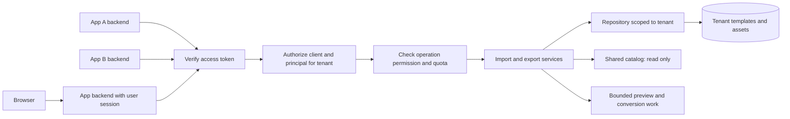

# Adding tenancy to the PowerPoint microservice

Research date: September 10, 2026. Repository reviewed at commit `892453a` with an initially clean working tree. This is a design recommendation; tenancy has not been implemented.

**Recommendation**

Keep one shared Express service, authenticate each calling application, and require a verified tenant context for every protected operation. Start with one private tenant per app if each app needs its own catalog. Keep app identity separate from tenant identity so that an app can later serve multiple customer workspaces, or two apps can deliberately share one workspace.

Implement authentication, scoped persistence, protected asset resolution, and resource limits as one coherent release. For a small internal pilot, the current SQLite store can remain while these boundaries are added. For a production service serving independently trusted customers or requiring multiple API replicas, my recommended target is PostgreSQL with row-level security and application authorization. Dedicated databases or deployments remain options when customer requirements justify them.

This recommendation assumes moderate initial traffic, no established requirement for dedicated infrastructure, and private imported templates. Deployment topology, identity provider, traffic, and customer isolation requirements have not been supplied or independently verified.

**What “tenant” should mean here**

Multiple callers require application authentication and permissions. Separate tenancy is needed when those callers need separate data ownership, configuration, quotas, or administrative control. Simply having two frontends does not establish two different data owners.

| Identity | Meaning in the proposed service | Example |
| --- | --- | --- |
| Application/client | The software making the request | Assessment app, reporting app |
| Tenant | The workspace that owns templates and consumes a quota | An app's private workspace, or a customer workspace |
| Principal | The authenticated workload or user performing an operation | A service account, or a signed-in user |

Provision separate tenant IDs for app-private data initially. If a customer uses two apps but their data should remain separate, give those app workspaces distinct tenants even when they belong to the same organization. If sharing is intended, explicitly grant both clients access to the same tenant. Never merge ownership merely because organization names or email domains match. This is a proposed product policy, pending confirmation of the desired sharing model.

Microsoft distinguishes tenants from deployments and describes isolation as a spectrum across compute, storage, and other resources. Tenant identity therefore does not force one deployment per app. [Microsoft tenancy models](https://learn.microsoft.com/en-us/azure/architecture/guide/multitenant/considerations/tenancy-models).

**Findings from this repository**

| Current behavior | Implication for tenancy | Code evidence |
| --- | --- | --- |
| Express 5.2.1 mounts import, batch import, export, and template routers without authentication or authorization middleware. | Any caller able to reach this application can invoke these operations; an upstream deployment control was not verified. | [app.ts](../server/src/app.ts:22) |
| One SQLite repository holds templates, metadata, assets, and previews. Schema version 2 has no tenant ownership columns. | Listing, lookup, and deletion operate over a shared catalog. | [SqliteTemplateRepository.ts](../server/src/repositories/SqliteTemplateRepository.ts:54) |
| Repository methods accept template/asset IDs, with no caller context. | A middleware-only change cannot constrain service-level lookups. | [TemplateRepository.ts](../server/src/repositories/TemplateRepository.ts:51) |
| Export resolves image paths such as `/import/{templateId}/assets/{assetId}` through the repository. | Caller-supplied JSON can reference stored assets. Both export paths need ownership checks even when no template is explicitly selected. | [TemplateAssets.ts](../server/src/services/TemplateAssets.ts:64), [ExportPowerPointService.ts](../server/src/services/ExportPowerPointService.ts:53) |
| Reading a template can externalize legacy images, repair dimensions, and persist an update. | Reads contain a write path that must be scoped; a read-only shared catalog needs special handling. | [ImportTemplateService.ts](../server/src/services/ImportTemplateService.ts:215) |
| Built-in templates are seeded into the same tables as imports. The delete path does not distinguish built-ins. | Shared reference data needs explicit read and write policies. | [seedBuiltinTemplates.ts](../server/src/catalog/seedBuiltinTemplates.ts:28), [templateRoutes.ts](../server/src/routes/templateRoutes.ts:19) |
| The frontend uses API fetches and direct preview image URLs. Preview images are also fetched for model selection. | Authentication must cover image requests and helper fetches, not just the main API adapter. | [templateApi.ts](../web/src/lib/api/templateApi.ts:40), [TemplatePicker.tsx](../web/src/components/TemplatePicker.tsx:276), [modelSelector.ts](../web/src/lib/modelSelector.ts:81) |
| Browser login stores an email in session storage. | It provides no server-verifiable identity. | [App.tsx](../web/src/App.tsx:384) |
| Preview generation uses one process-local promise queue. | One app can delay others; the queue has no explicit tenant admission limits. | [TemplatePreview.ts](../server/src/services/TemplatePreview.ts:107) |

Useful foundations already exist: an injected app factory, repository abstraction, transactional batch inserts, cascading asset deletion, upload/JSON/ZIP limits, temporary-directory cleanup, request IDs, and API tests. These make an incremental implementation practical. Preserve slide IDs, geometry, layering, image fidelity, normalization, PPTX behavior, and the browser/Node runtime boundary.

**Architecture and storage options**

AWS describes pooled resources, dedicated tenant resources, and a hybrid of the two as pool, silo, and bridge models. The comparison below applies those patterns to this repository. [AWS isolation models](https://docs.aws.amazon.com/wellarchitected/latest/saas-lens/silo-pool-and-bridge-models.html).

| Option | Advantages | Costs and limitations | Recommendation |
| --- | --- | --- | --- |
| Shared SQLite with tenant columns | Smallest storage change; retains current deployment shape | Isolation depends on correct application queries; current synchronous repository and one database writer limit scaling options | Suitable for a bounded internal pilot |
| Shared PostgreSQL with tenant columns and row-level security | Central migrations; supports multiple API replicas; database policies add protection against omitted filters | Adds database operations and an asynchronous repository refactor; shared capacity still needs limits | Preferred production target |
| Database per tenant | Easier tenant-specific restore and data placement | Provisioning, credentials, connection management, and migrations multiply; shared app credentials can still cross boundaries | Use for explicit customer requirements |
| Schema per tenant | Separate namespaces within one database | Grants and schema selection need discipline; migrations multiply; shared resources remain | Little benefit for this small catalog today |
| Deployment per tenant | Can isolate compute, storage, credentials, and failures | Highest deployment and operational overhead | Reserve for strong isolation commitments |

SQLite permits only one writer at a time per database file; this does not mean a small multi-app API cannot use it. Its own guidance recommends a client/server database when concurrency or networked database access requires it. Do not scale this service by sharing its SQLite file across arbitrary hosts. [SQLite deployment guidance](https://www.sqlite.org/whentouse.html).

A pooled database makes tenant-specific restore and deletion more involved. Independent backup policies, encryption keys, or regional placement can justify dedicated storage. These requirements should be established before choosing the final production layout. [Microsoft multitenant storage guidance](https://learn.microsoft.com/en-us/azure/architecture/guide/multitenant/approaches/storage-data).

This is the proposed architecture. An API gateway can add perimeter controls, but the service must still verify its trusted request identity or use an equivalently protected identity propagation contract. A publicly supplied identity header is insufficient.

**Authentication and tenant selection**

Use the existing organizational identity provider if one is available. For backend-to-backend calls, register each app separately and use OAuth client credentials; that grant is for confidential clients capable of protecting their credentials. Prefer managed workload identity or certificates when supported by the selected platform. [OAuth client credentials](https://www.rfc-editor.org/rfc/rfc6749.html#section-4.4).

Validate access-token signature, allowed algorithm, issuer, intended audience, expiry, and applicable not-before restrictions. Map the provider's verified client claim to an internal client record; do not assume `sub` always identifies an application. Accept only the expected token profile, and obtain signing keys from configured trusted issuers. [JWT security guidance](https://www.rfc-editor.org/rfc/rfc8725.html). Require an audience specific to this API; reject an otherwise valid token issued for another service. [OAuth security best current practice](https://www.rfc-editor.org/rfc/rfc9700.html#section-2.3).

A tenant header or route parameter may select a workspace, but the service must check the verified principal's authorization for that workspace. OWASP recommends establishing tenant context early and propagating only verified context through tenant-sensitive operations. [OWASP tenant context guidance](https://cheatsheetseries.owasp.org/cheatsheets/Multi_Tenant_Security_Cheat_Sheet.html#1-tenant-identification-context-management).

For this service, introduce a required, immutable request context containing `tenantId`, `clientId`, `principalId`, granted permissions, and `requestId`. Pass it explicitly into import/export services and scoped repository operations. Never store a mutable “current tenant” on the singleton service or SQLite repository. Authentication and operation authorization should run before buffering PPTX/JSON bodies.

For a user-driven backend call, decide who enforces user permissions: either validate delegated user identity here, or explicitly trust the calling backend to authorize its user. A client-credentials token alone proves the workload's identity, not which end user initiated an action. Restrict each workload to its approved tenants and operations.

If no identity provider is ready, individually revocable opaque API keys can be an interim backend-only mechanism: store a digest, bind each key to permitted tenants/scopes, support rotation, and meter by client. This creates credential administration work and should not become a browser secret or a single shared key for every app.

**Ownership and repository design**

Proposed records:

| Record | Purpose |
| --- | --- |
| `tenants` | Stable ID, display name, active/suspended status, quota policy |
| `api_clients` | Trusted issuer/client mapping and active status |
| `client_tenant_grants` | Explicit client-to-tenant permissions |
| Tenant-owned templates, metadata, assets, previews | Add non-null tenant ownership throughout the existing four-table model |
| Shared catalog | Separately classified platform-owned templates, readable by eligible callers and writable only through catalog administration |

Keep existing template IDs stable. Add a unique `(tenant_id, template_id)` relationship and tenant-aware foreign keys from metadata, previews, and assets. The existing global UUID key can remain; tenant checks are still required. Every read, list, join, update, delete, batch insert, and asset resolution must carry the tenant constraint. Include tenant ownership in relevant indexes.

Prefer an explicit tenant-scoped repository facade over optional tenant parameters. Request code should have no general “find any template” method. Isolate privileged catalog seeding and migration capabilities from request dependencies. Tenant ownership is server-assigned and immutable through ordinary update APIs.

Handle built-ins through a clearly separate catalog read path. Ordinary clients may read authorized built-ins but cannot update or delete the shared originals. If customization is needed, copy a built-in into the tenant's ownership with a new ID. Normalize shared records during seeding/migration so the existing read-time repair does not write through a shared read path. Do not make an unknown tenant or a missing tenant mean “global.”

For PostgreSQL, enable row-level security on every tenant-owned table and constrain both visible rows and inserted/updated ownership. Use a request role that is neither owner, superuser, nor `BYPASSRLS`; consider `FORCE ROW LEVEL SECURITY` for owner-sensitive paths. RLS does not govern every operation, including `TRUNCATE`, so do not grant unnecessary privileges. Shared catalog access needs a separate, narrow policy. [PostgreSQL row security](https://www.postgresql.org/docs/current/ddl-rowsecurity.html).

Set the verified tenant inside each short database transaction using parameterized `set_config('app.tenant_id', value, true)` on the same checked-out connection. The final argument makes the setting transaction-local. Commit or roll back before returning the connection, and deny access when context is absent or invalid. Do not hold a transaction open during PPTX conversion or rendering. [PostgreSQL configuration functions](https://www.postgresql.org/docs/current/functions-admin.html#FUNCTIONS-ADMIN-SET).

RLS provides a second boundary against query mistakes; it cannot compensate for an application deliberately setting the wrong trusted tenant. Retain service authorization, strict input handling, and tests using the actual restricted database role.

**Required coverage for the current API**

Permission names below are proposed application permissions, to be mapped to the chosen provider's scopes or roles.

| Existing operation | Proposed permission | Enforcement |
| --- | --- | --- |
| `POST /import`, `POST /batchImport` | `templates:write` | Assign ownership from context; reserve capacity before conversion; preserve batch atomicity |
| `GET /templates` | `templates:read` | Return the current tenant's catalog plus permitted built-ins; add bounded pagination |
| `GET /templates/:templateId`, legacy `GET /import/:templateId` | `templates:read` | Scope lookup, joined assets, and any legacy repair |
| `GET /templates/:templateId/preview` | `templates:read` | Authorize before returning bytes |
| `GET /import/:templateId/assets/:assetId` | `templates:read` | Require the permitted template and its matching asset |
| `DELETE /templates/:templateId` | `templates:delete` | Delete only tenant-owned rows; deny deletion of shared built-ins |
| `POST /export`, `POST /export/insert` | `presentations:export` | Also require read authorization for each referenced stored asset |

The export case deserves a specific negative test: submit JSON from tenant A containing a known asset path belonging to B. The export must fail without including B's bytes. Apply the same rule during insertion into an uploaded target deck. Inline image data already supplied by the caller does not need a stored-asset lookup.

Use consistent errors: `401` for missing/invalid authentication, `403` for unavailable tenant membership or operation permission, and `404` for inaccessible resource lookups without confirming another tenant's resource exists. The existing export validation may retain a generic `422` for unresolved embedded references if missing and forbidden references are indistinguishable. Authentication is an intentional API compatibility change; preserve existing JSON and binary response contracts where possible.

**Browser integration**

My preference is an application backend that manages the user's session and calls the service with backend credentials or delegated tokens. It can proxy protected images on the app's origin. Cookie-based sessions need CSRF protection for state-changing requests and appropriate cookie attributes.

If browsers call this API directly, use an established authorization-code flow with PKCE and short-lived access tokens; never embed a service client secret. PKCE is required for public clients by the current OAuth security guidance. [OAuth browser client guidance](https://www.rfc-editor.org/rfc/rfc9700.html#section-2.1.1).

The direct browser option requires an authenticated fetch helper for API operations and preview downloads. Load protected image bytes through that helper, create object URLs for image elements, and revoke them on replacement/unmount. Update model-selection and diagram-generation image fetches too. Clear tenant-specific catalog, selection, preview, and document state on tenant switching, and discard responses from the old tenant. Do not put bearer tokens in preview URLs.

For cross-origin browser access, explicitly allow approved origins, authorization/tenant headers, and required response headers such as `X-Template-Id`, preview status, and `Content-Disposition`. CORS determines browser access to responses; it does not establish caller identity. [MDN CORS](https://developer.mozilla.org/en-US/docs/Web/HTTP/Guides/CORS).

The current browser OpenAI adapter remains a separate production concern: [OpenAI.ts](../web/src/lib/OpenAI.ts:66) enables browser credentials, and [vite.config.ts](../web/vite.config.ts:8) embeds configured key values. Adding tenancy to the PowerPoint API does not bring those model calls under its authorization or quotas. Any shared production generation service needs its own narrow server endpoint and verified tenant context.

**Capacity, audit, and tenant lifecycle**

The initial operational priority is bounding import/export and preview work. Retain current body/ZIP limits; add per-client and per-tenant rate limits, concurrent conversion limits, a maximum queued workload, stored-byte/template quotas, and a batch slide cap. Keep a global limit as well. A single shared FIFO preview queue needs admission control and fair scheduling to prevent one tenant consuming all capacity. Microsoft identifies shared-resource contention and recommends controls such as throttling and resource isolation. [Noisy neighbor guidance](https://learn.microsoft.com/en-us/azure/architecture/antipatterns/noisy-neighbor/noisy-neighbor).

Reserve quota atomically before work and release it on cancellation/failure. Measure queue wait, conversion duration, memory, write contention, and per-tenant error rates before setting production values. Returning an HTTP timeout alone does not guarantee expensive computation stopped; conversion interfaces need cancellation/offload review.

Add durable jobs only when measured latency/reliability needs justify a new asynchronous API. Such jobs must retain trusted tenant/client ownership, recheck suspension policy at execution, and authorize status/download requests. Scope idempotency keys to tenant, client, operation, and payload fingerprint; the same key in another tenant must not reuse a result. If replicas are introduced, coordinate admission limits outside a single process.

Record tenant/client/principal IDs, request ID, operation, result, duration, and usage quantities. Keep content, filenames, tokens, and credentials out of logs. If a cache or object store is introduced, classify global versus tenant data, include ownership in keys, and authorize access before retrieval. Namespace separation alone is not authorization. [OWASP tenancy controls](https://cheatsheetseries.owasp.org/cheatsheets/Multi_Tenant_Security_Cheat_Sheet.html).

Onboarding should explicitly create the tenant and grants; an arbitrary header must never auto-create a workspace. Suspension must deny new work and define what happens to queued work. Offboarding should revoke grants, cancel remaining work, and delete tenant records, assets, previews, and future artifacts according to the retention policy. Document when backups expire and test tenant-specific restoration into an isolated staging database before selectively recovering data.

**Implementation sequence and migration**

| Phase | Deliverable | Acceptance gate |
| --- | --- | --- |
| 1. Establish identity and ownership | Select identity provider, tenant meaning, sharing policy, and legacy data owner; define context and permission contract | Two synthetic apps have distinct credentials and explicit grants |
| 2. Implement isolation together | Auth before parsers; tenant-aware schema/repository; all services and asset paths scoped; protected shared catalog; browser integration | Two tenants cannot read, alter, delete, export, or repair each other's records |
| 3. Bound operations | Quota reservation, queue/concurrency limits, audit events, suspension and credential rotation | Busy tenant A cannot exhaust the admitted capacity reserved for B |
| 4. Production storage where required | PostgreSQL adapter, asynchronous call chain, RLS, migration and restore rehearsal | Restricted-role tests and connection-reuse tests pass; required replica topology works |

For a small internal pilot, phases 1–3 can use SQLite. For independent customer tenants or multiple API replicas, include phase 4 before launch. PostgreSQL is not a drop-in driver swap: repository reads currently return synchronously, so services, handlers, asset hydration, catalog seeding, and tests must propagate asynchronous operations.

Migrate a consistent backup copy first. Classify built-ins separately and assign each existing imported template to an explicit owner; quarantine ambiguous records. Do not label all legacy rows public or default them to whichever app calls first. Backfill child ownership, validate referential integrity, and verify counts plus JSON/asset/preview checksums without printing document content.

For SQLite, plan a transactional table rebuild if necessary to introduce non-null ownership and composite foreign keys. Rehearse with the actual version-2 schema and then confirm the migrated schema is rejected by older code. Cut over with writes paused and all callers updated. Keep the original backup; after new writes begin, rollback needs a reconciliation plan, not an automatic downgrade to unscoped code.

Preserve current template IDs, asset paths, slide content, and binary behavior. Keep tenant identity outside the presentation JSON: the same slide document should remain usable in browser rendering and local Node conversion. Pure normalization and standalone CLIs do not need an implicit ambient tenant; any future CLI that accesses shared service storage must use explicit authenticated ownership.

**Verification and effort**

Extend the existing import/export/catalog suites with a two-tenant, two-client matrix covering missing/invalid tokens, wrong audience, unauthorized tenant selection, suspension, every route and alias, forged export asset references, shared catalog writes, tenant-scoped legacy repair, mixed-owner batch rollback, and concurrent requests. Test missing context as a denial, never an unscoped fallback. For PostgreSQL, repeat with the deployed restricted role, reused connections, and policy coverage across all tenant-owned tables.

Browser acceptance should cover protected previews, model-selection preview fetches, tenant switching, stale requests, and expired sessions. Preserve PPTX round-trip checks and broad type/test/build checks during implementation. Load tests should measure fairness and cancellation using synthetic decks, with no live model calls.

Planning estimate, not a measured commitment: approximately 2–3 engineer-weeks for the complete internal pilot boundary if an identity provider and app backend already exist; approximately 1–2 additional weeks for PostgreSQL/RLS migration, deployment integration, and restore rehearsal. Identity setup, new browser login infrastructure, dedicated isolation, and durable jobs can extend that materially. Scope this after the ownership and hosting decisions are settled.

For this report, the following existing baseline command passed: `npm run test --workspace @diligence-studio/server -- test/importApi.test.ts test/exportApi.test.ts test/catalogAndPreview.test.ts` — **35 tests passed across 3 files**. The first sandboxed attempt could not bind Supertest's temporary ports (`listen EPERM`); rerunning with that restriction lifted passed. This was an environment restriction, not an established product failure. These are existing behavior tests, not evidence that tenancy is already secure.

Only research documentation changed. No production database or real environment file was read, and no model requests were made. Full typecheck/build, browser inspection, load tests, and new tenancy tests were not run because no implementation was performed. Sources above are primary project/vendor/standards documentation checked on the research date; the architecture, rollout, and estimates are my synthesis for this repository, not vendor guarantees.
